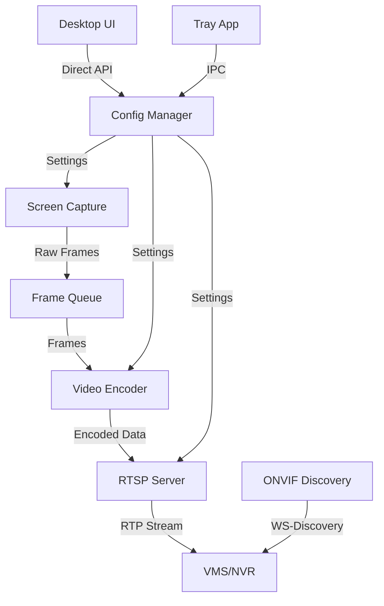

# Screen-to-RTSP ONVIF Bridge - Architecture Design Document

## Table of Contents
1. [Project Overview](#project-overview)
2. [System Architecture](#system-architecture)
3. [Core Components](#core-components)
4. [Technology Stack](#technology-stack)
5. [Codec Implementation](#codec-implementation)
6. [Network Services](#network-services)
7. [Security Features](#security-features)
8. [Performance Optimization](#performance-optimization)
9. [User Interface](#user-interface)
10. [Deployment & Integration](#deployment--integration)
11. [Implementation Roadmap](#implementation-roadmap)

## Project Overview

### Purpose
The Screen-to-RTSP ONVIF Bridge is a lightweight, efficient application that captures computer screen content and streams it as an RTSP video feed with ONVIF compatibility. This enables integration with professional Network Video Recorders (NVR) and Video Management Systems (VMS) like NX Witness, treating the computer as an IP camera.

### Key Features
- Cross-platform screen capture (Windows, macOS, Linux)
- Real-time RTSP streaming with low latency
- ONVIF Profile S compliance for VMS integration
- H.264/H.265 codec support with hardware acceleration
- Multiple stream profiles (main/sub streams)
- Secure authentication and encryption
- Minimal resource usage (<15% CPU for 1080p30)
- Simple configuration interface

### Target Use Cases
- Remote desktop monitoring
- Digital signage recording
- Presentation capture
- Security monitoring of computer activities
- Integration with existing surveillance infrastructure

## System Architecture

### High-Level Architecture

```
┌─────────────────────────────────────────────────────────────────┐
│                         User Layer                               │
├─────────────────────────┬───────────────────────────────────────┤
│   System Tray App       │      Native Desktop Application      │
│   (Native APIs)         │       (C++ Cross-Platform UI)       │
└─────────────────────────┴───────────────────────────────────────┘
                                      │
┌─────────────────────────────────────┴───────────────────────────┐
│                    Configuration Manager                         │
│      (JSON Settings, Profiles, Security, Auto-save)             │
└─────────────────────────────────────┬───────────────────────────┘
                                      │
┌─────────────────────────────────────┴───────────────────────────┐
│                      Service Core                                │
├──────────────┬──────────────┬──────────────┬───────────────────┤
│Screen Capture│Video Pipeline│ RTSP Server  │  ONVIF Services   │
│   Engine     │   (FFmpeg)   │  (live555)   │ (Minimal SOAP)   │
├──────────────┼──────────────┼──────────────┼───────────────────┤
│Platform APIs │ H.264/H.265  │RTP/RTCP/RTSP│Device Management  │
│DX11/AVF/X11  │HW Encoders   │Authentication│Stream URI Only    │
│Multi-Monitor │Rate Control  │Multi-Client  │WS-Discovery       │
└──────────────┴──────────────┴──────────────┴───────────────────┘
```

### Data Flow

```
Screen Content → Capture → Color Convert → Encode → Packetize → Stream
     ↓              ↓           ↓            ↓          ↓          ↓
   Display      Platform    YUV/RGB     H.264/265   RTP/RTSP   Network
   Buffer        APIs       Format      Bitstream    Packets    Clients
```

### Component Interaction



## Core Components

### Screen Capture Engine

**Responsibilities:**
- Capture screen content at native resolution for each display
- Support multi-monitor configurations with per-monitor resolution
- Handle resolution changes dynamically (display settings changes)
- Minimize CPU usage through efficient APIs
- Always match the actual screen resolution (no scaling/resampling)

**Platform Implementations:**

#### Windows
```cpp
class WindowsCaptureEngine : public ICaptureEngine {
    // Uses Desktop Duplication API (DXGI)
    // Fallback to GDI+ for older systems
    // DirectX 11 for GPU acceleration
};
```

#### macOS
```cpp
class MacOSCaptureEngine : public ICaptureEngine {
    // AVFoundation for screen capture
    // CoreGraphics for fallback
    // Metal for GPU operations
};
```

#### Linux
```cpp
class LinuxCaptureEngine : public ICaptureEngine {
    // X11/XCB for X.org systems
    // PipeWire for Wayland
    // VAAPI for acceleration
};
```

### Video Encoding Pipeline

**Architecture:**
```cpp
class VideoEncodingPipeline {
    std::unique_ptr<IEncoder> encoder;  // H.264/H.265
    FrameQueue inputQueue;              // Thread-safe queue
    PacketQueue outputQueue;            // Encoded packets
    
    void ProcessFrame(Frame& frame) {
        // Color conversion if needed
        // Apply privacy masks
        // Encode with selected codec
        // Manage bitrate/quality
    }
};
```

**Codec Support:**
- H.264: Baseline, Main, High profiles
- H.265: Main, Main10 profiles
- Dynamic codec switching
- Multiple quality presets

### RTSP Server

**Implementation:**
```cpp
class RTSPServer {
    live555::RTSPServer* server;
    std::map<string, ClientSession> sessions;
    
    void HandleRequest(RTSPRequest& req) {
        // Authentication
        // Session management
        // Stream control (PLAY/PAUSE/TEARDOWN)
    }
};
```

**Features:**
- RFC 2326 compliant
- RTP/RTCP transport
- TCP and UDP streaming
- RTSP over HTTP tunneling
- Multiple concurrent clients

### ONVIF Service Layer (Minimal Implementation)

**Services Implementation:**

```cpp
// Minimal ONVIF for VMS Discovery
class MinimalONVIFService {
    // Only implement essential methods for NVR detection
    
    GetDeviceInformation() {
        // Return basic device info
        return {
            manufacturer: "ScreenToRTSP",
            model: "Desktop Camera",
            serialNumber: GetMachineID()
        };
    }
    
    GetStreamUri() {
        // Return RTSP URL - most important method
        return "rtsp://" + localIP + ":554/stream";
    }
    
    GetProfiles() {
        // Return single profile for simplicity
        return [{
            token: "MainProfile",
            name: "Desktop Stream",
            streamUri: GetStreamUri()
        }];
    }
};

// Simple Discovery
class SimpleWSDiscovery {
    void RespondToProbe() {
        // Only respond to discovery probes
        // Skip Hello/Bye for simplicity
    }
};
```

## Technology Stack

### Core Development
- **Primary Language**: C++17/20 for performance-critical components
- **Build System**: CMake 3.20+ with modern features
- **Dependency Management**: Minimal external dependencies, prefer system libraries

### Key Libraries

#### Media Processing
- **FFmpeg 5.0+**: Video encoding, muxing, filters
  - libavcodec: H.264/H.265 encoding
  - libavformat: Container handling
  - libavfilter: Video processing
  - libswscale: Color conversion

#### Networking
- **live555 2023.07+**: RTSP server implementation
- **gSOAP 2.8+**: ONVIF SOAP service generation (optional, only for full ONVIF)
- **OpenSSL 3.0+**: TLS/encryption support (optional, for RTSP encryption)

#### User Interface
- **System Tray**: Native platform APIs
  - Windows: Shell_NotifyIcon
  - macOS: NSStatusItem
  - Linux: libappindicator
- **Desktop UI**: Lightweight C++ GUI framework
  - Dear ImGui: Immediate mode GUI (header-only, minimal deps)
  - Platform backends: DirectX/OpenGL/Metal
  - Native window management

#### Platform-Specific
- **Windows**: Windows SDK, DirectX 11 SDK
- **macOS**: Xcode, AVFoundation framework
- **Linux**: X11/XCB libraries, PipeWire

### Development Tools
- **Compiler**: MSVC 2022, GCC 11+, Clang 14+
- **Static Analysis**: clang-tidy, PVS-Studio
- **Testing**: Google Test, Catch2
- **Documentation**: Doxygen

## Codec Implementation

### Codec Architecture

```cpp
class CodecManager {
    enum class CodecType { H264, H265 };
    
    struct CodecProfile {
        CodecType type;
        string profile;      // baseline, main, high
        int level;           // 3.0, 3.1, 4.0, etc.
        int bitrate;         // Target bitrate
        int maxBitrate;      // VBR max
        int keyInterval;     // GOP size
        string preset;       // ultrafast to slow
    };
    
    struct EncoderCapabilities {
        bool supportsH264;
        bool supportsH265;
        bool hardwareAccel;
        vector<string> hwDevices;
    };
};
```

### Hardware Acceleration Support

#### NVIDIA NVENC
```cpp
class NVENCEncoder : public IHardwareEncoder {
    // Supports: H.264 (all GPUs), H.265 (GTX 960+)
    // Features: B-frames, multiple reference frames
    // Performance: 4K60 on modern GPUs
};
```

#### Intel QuickSync
```cpp
class QSVEncoder : public IHardwareEncoder {
    // Supports: H.264 (Sandy Bridge+), H.265 (Skylake+)
    // Features: Low latency mode, VBR/CBR
    // Performance: Excellent power efficiency
};
```

#### AMD VCE/VCN
```cpp
class AMFEncoder : public IHardwareEncoder {
    // Supports: H.264 (GCN+), H.265 (Polaris+)
    // Features: Pre-analysis, B-frames
    // Performance: Good quality/performance ratio
};
```

#### Apple VideoToolbox
```cpp
class VTEncoder : public IHardwareEncoder {
    // Supports: H.264 (all Macs), H.265 (10.13+)
    // Features: Hardware optimized for Apple Silicon
    // Performance: Excellent on M1/M2 chips
};
```

### Codec Selection Logic

```cpp
CodecType SelectOptimalCodec(const StreamConfig& config) {
    // Check NVR/VMS compatibility
    if (!config.targetDevice.supportsH265) {
        return CodecType::H264;
    }
    
    // Check native screen resolution and bandwidth
    int screenWidth = GetSystemMetrics(SM_CXSCREEN);
    int screenHeight = GetSystemMetrics(SM_CYSCREEN);
    
    if (screenWidth >= 3840 && config.bandwidth > 20000) {
        return CodecType::H265;  // Better for 4K displays
    }
    
    // Check hardware support
    if (!encoder.hasHardwareH265()) {
        return CodecType::H264;
    }
    
    // Default to H.264 for compatibility
    return CodecType::H264;
}
```

### Encoding Profiles

```yaml
encoding_profiles:
  high_quality:
    codec: h265
    preset: medium
    bitrate: 15000  # Kbps
    max_bitrate: 20000
    profile: main
    level: 5.1
    
  balanced:
    codec: h264
    preset: fast
    bitrate: 8000
    max_bitrate: 10000
    profile: high
    level: 4.2
    
  low_bandwidth:
    codec: h264
    preset: ultrafast
    bitrate: 2000
    max_bitrate: 3000
    profile: baseline
    level: 3.1
```

## Network Services

### RTSP Server Implementation

**Core Features:**
- Multi-threaded architecture
- Zero-copy packet handling
- Efficient memory pooling
- Dynamic port allocation

**Session Management:**
```cpp
class RTSPSession {
    string sessionId;
    ClientInfo client;
    StreamProfile profile;
    TransportMode transport;  // RTP/UDP, RTP/TCP, HTTP
    
    void HandlePlay();
    void HandlePause();
    void HandleTeardown();
    void HandleGetParameter();  // Keep-alive
};
```

### ONVIF Compliance

**Profile S Requirements:**
- Device discovery via WS-Discovery
- GetProfiles with at least one profile
- GetStreamUri returning valid RTSP URL
- Continuous recording capability
- Event subscription (optional)

**WSDL Implementation:**
```xml
<!-- Device Management Service -->
<wsdl:definitions name="DeviceManagement">
    <wsdl:operation name="GetDeviceInformation">
        <wsdl:input message="tds:GetDeviceInformationRequest"/>
        <wsdl:output message="tds:GetDeviceInformationResponse"/>
    </wsdl:operation>
</wsdl:definitions>
```

### Media Profiles

```cpp
struct MediaProfile {
    string token;           // Unique identifier
    string name;            // User-friendly name
    VideoSourceConfig videoSource;
    VideoEncoderConfig videoEncoder;
    AudioSourceConfig audioSource;    // Optional
    AudioEncoderConfig audioEncoder;  // Optional
    
    StreamUri GetStreamUri(StreamType type) {
        // Return RTSP URL for this profile
    }
};
```

## Security Features

### Authentication Mechanisms

**RTSP Authentication:**
```cpp
class RTSPAuthenticator {
    enum AuthType { NONE, BASIC, DIGEST };
    
    bool Authenticate(const Request& req) {
        if (authType == DIGEST) {
            // RFC 2617 Digest Authentication
            return ValidateDigest(req.headers);
        }
        return true;
    }
};
```

**ONVIF Authentication:**
```cpp
class ONVIFAuthenticator {
    bool ValidateUsernameToken(const SOAPHeader& header) {
        // WS-UsernameToken validation
        // Nonce and timestamp verification
        // Password digest computation
    }
};
```

### Encryption Support

**TLS/HTTPS Configuration:**
```cpp
struct TLSConfig {
    string certFile;
    string keyFile;
    string caFile;
    int minVersion;  // TLS 1.2 minimum
    vector<string> cipherSuites;
};
```

### Access Control

```cpp
class AccessController {
    vector<IPRange> whitelist;
    vector<IPRange> blacklist;
    map<string, UserPermissions> users;
    
    bool IsAllowed(const ClientInfo& client) {
        // IP-based filtering
        // User-based permissions
        // Rate limiting
    }
};
```

### Privacy Features

```cpp
class PrivacyMask {
    vector<Rectangle> maskedAreas;
    MaskType type;  // BLUR, PIXELATE, BLACK
    
    void ApplyToFrame(Frame& frame) {
        // Apply privacy masks to sensitive areas
    }
};
```

## Performance Optimization

### Multi-Threading Architecture

```cpp
class ThreadPool {
    // Capture Thread: Screen capture at consistent FPS
    // Encoding Thread Pool: Parallel encoding for multi-core
    // Network Thread: RTSP request handling
    // ONVIF Thread: SOAP service handling
};
```

### Memory Management

**Zero-Copy Pipeline:**
```cpp
class FrameBuffer {
    // Shared memory between capture and encoder
    // Ring buffer for frame queue
    // Memory pool for packet allocation
    // Reference counting for efficient sharing
};
```

### Adaptive Quality Control

```cpp
class QualityController {
    void AdjustBitrate() {
        if (cpuUsage > 80%) {
            // Reduce quality/framerate
        }
        if (networkCongestion) {
            // Lower bitrate
        }
        if (droppedFrames > threshold) {
            // Skip frames
        }
    }
};
```

### Hardware Utilization

```cpp
class HardwareManager {
    void SelectOptimalDevice() {
        // Detect available GPUs
        // Benchmark encoding performance
        // Select best device for workload
        // Fall back to CPU if needed
    }
};
```

## User Interface

### System Tray Application

**Features:**
- Start/stop streaming
- Quick access to settings
- Stream status indicator
- Resource usage display

**Implementation:**
```cpp
class TrayApplication {
    void CreateMenu() {
        menu.addAction("Start Streaming", StartStream);
        menu.addAction("Settings", OpenSettings);
        menu.addAction("View Stream", OpenPreview);
        menu.addSeparator();
        menu.addAction("Exit", QuitApp);
    }
};
```

### Desktop Configuration Application

**Technology Stack:**
- UI Framework: Dear ImGui (immediate mode GUI)
- Rendering: Platform-native (DirectX 11/OpenGL/Metal)
- Window Management: Native platform APIs
- Configuration: Direct JSON file access

**Main Window Implementation:**
```cpp
// Desktop GUI using Dear ImGui
class ConfigurationWindow {
private:
    ImGuiContext* context;
    Config config;
    StreamStatus status;
    
public:
    void Render() {
        ImGui::Begin("Talos Desk - Configuration", nullptr, 
                     ImGuiWindowFlags_NoResize | ImGuiWindowFlags_NoCollapse);
        
        // Status Panel
        ImGui::Text("Stream Status:");
        ImGui::SameLine();
        if (status.isStreaming) {
            ImGui::TextColored(ImVec4(0.0f, 1.0f, 0.0f, 1.0f), "● STREAMING");
            ImGui::Text("RTSP URL: rtsp://%s:%d/stream", 
                       status.localIP.c_str(), config.rtspPort);
        } else {
            ImGui::TextColored(ImVec4(1.0f, 0.0f, 0.0f, 1.0f), "● STOPPED");
        }
        
        ImGui::Separator();
        
        // Video Settings
        if (ImGui::CollapsingHeader("Video Settings", ImGuiTreeNodeFlags_DefaultOpen)) {
            // Codec Selection
            const char* codecs[] = { "H.264 (Most Compatible)", "H.265 (Better Compression)" };
            static int codecIndex = 0;
            ImGui::Text("Codec:");
            ImGui::SameLine(120);
            ImGui::SetNextItemWidth(300);
            ImGui::Combo("##codec", &codecIndex, codecs, IM_ARRAYSIZE(codecs));
            
            // Resolution - Always native by default
            ImGui::Text("Resolution:");
            ImGui::SameLine(120);
            ImGui::TextColored(ImVec4(0.0f, 1.0f, 0.0f, 1.0f), 
                             "%dx%d (Native)", 
                             config.screenWidth, config.screenHeight);
            ImGui::SameLine();
            ImGui::TextDisabled("(?)");
            if (ImGui::IsItemHovered()) {
                ImGui::SetTooltip("Recording always matches your screen's native resolution\n"
                                "for best quality and performance");
            }
            
            // Frame Rate
            ImGui::Text("Frame Rate:");
            ImGui::SameLine(120);
            ImGui::SetNextItemWidth(300);
            ImGui::SliderInt("##fps", &config.fps, 15, 60, "%d fps");
            
            // Bitrate
            ImGui::Text("Bitrate:");
            ImGui::SameLine(120);
            ImGui::SetNextItemWidth(300);
            ImGui::SliderInt("##bitrate", &config.bitrate, 1000, 50000, "%d Kbps");
            
            // Quality Preset
            const char* presets[] = { "High Quality", "Balanced", "Low Bandwidth" };
            static int presetIndex = 1;
            ImGui::Text("Quality Preset:");
            ImGui::SameLine(120);
            ImGui::SetNextItemWidth(300);
            ImGui::Combo("##preset", &presetIndex, presets, IM_ARRAYSIZE(presets));
        }
        
        ImGui::Separator();
        
        // Network Settings
        if (ImGui::CollapsingHeader("Network Settings")) {
            // RTSP Port
            ImGui::Text("RTSP Port:");
            ImGui::SameLine(120);
            ImGui::SetNextItemWidth(300);
            ImGui::InputInt("##rtsp_port", &config.rtspPort);
            
            // Authentication
            const char* authTypes[] = { "None", "Digest Authentication" };
            static int authIndex = 0;
            ImGui::Text("Authentication:");
            ImGui::SameLine(120);
            ImGui::SetNextItemWidth(300);
            ImGui::Combo("##auth", &authIndex, authTypes, IM_ARRAYSIZE(authTypes));
            
            if (authIndex > 0) {
                ImGui::Text("Username:");
                ImGui::SameLine(120);
                ImGui::SetNextItemWidth(300);
                ImGui::InputText("##username", config.username, 256);
                
                ImGui::Text("Password:");
                ImGui::SameLine(120);
                ImGui::SetNextItemWidth(300);
                ImGui::InputText("##password", config.password, 256, 
                               ImGuiInputTextFlags_Password);
            }
        }
        
        ImGui::Separator();
        
        // Advanced Settings
        if (ImGui::CollapsingHeader("Advanced Settings")) {
            // Hardware Acceleration
            ImGui::Checkbox("Enable Hardware Acceleration", &config.useHwAccel);
            
            if (config.useHwAccel) {
                const char* hwTypes[] = { "Auto", "NVIDIA NVENC", "Intel QuickSync", 
                                        "AMD VCE/VCN", "Apple VideoToolbox" };
                static int hwIndex = 0;
                ImGui::Text("Hardware Type:");
                ImGui::SameLine(120);
                ImGui::SetNextItemWidth(300);
                ImGui::Combo("##hwtype", &hwIndex, hwTypes, IM_ARRAYSIZE(hwTypes));
            }
            
            // Multi-monitor
            ImGui::Checkbox("Enable Multi-Monitor Support", &config.multiMonitor);
            
            // Privacy Mask
            ImGui::Checkbox("Enable Privacy Masking", &config.privacyMask);
        }
        
        ImGui::Separator();
        
        // Control Buttons
        ImGui::Dummy(ImVec2(0.0f, 10.0f));
        
        if (!status.isStreaming) {
            if (ImGui::Button("Start Stream", ImVec2(120, 30))) {
                StartStreaming();
            }
        } else {
            if (ImGui::Button("Stop Stream", ImVec2(120, 30))) {
                StopStreaming();
            }
        }
        
        ImGui::SameLine();
        if (ImGui::Button("Save Settings", ImVec2(120, 30))) {
            SaveConfiguration();
        }
        
        ImGui::SameLine();
        if (ImGui::Button("View Stream", ImVec2(120, 30))) {
            LaunchStreamViewer();
        }
        
        ImGui::End();
    }
    
    void StartStreaming() {
        // Start streaming logic
        streamManager->Start(config);
        status.isStreaming = true;
    }
    
    void StopStreaming() {
        // Stop streaming logic
        streamManager->Stop();
        status.isStreaming = false;
    }
    
    void SaveConfiguration() {
        // Save to JSON file
        config.SaveToFile("config.json");
        ShowNotification("Settings saved successfully!");
    }
    
    void LaunchStreamViewer() {
        // Open default RTSP viewer
        std::string url = "rtsp://" + status.localIP + ":" + 
                         std::to_string(config.rtspPort) + "/stream";
        OpenURL(url);
    }
};

// Platform-specific window creation
class DesktopApplication {
    ConfigurationWindow* configWindow;
    
public:
    void Initialize() {
        // Setup Dear ImGui context
        IMGUI_CHECKVERSION();
        ImGui::CreateContext();
        ImGuiIO& io = ImGui::GetIO();
        
        // Setup Platform/Renderer backends
        #ifdef _WIN32
            ImGui_ImplWin32_Init(hwnd);
            ImGui_ImplDX11_Init(device, deviceContext);
        #elif __APPLE__
            ImGui_ImplOSX_Init();
            ImGui_ImplMetal_Init(device);
        #else
            ImGui_ImplGlfw_InitForOpenGL(window, true);
            ImGui_ImplOpenGL3_Init("#version 130");
        #endif
        
        // Setup style
        ImGui::StyleColorsDark();
        
        // Load fonts
        io.Fonts->AddFontFromFileTTF("assets/Roboto-Regular.ttf", 16.0f);
    }
    
    void Run() {
        while (!shouldClose) {
            // Poll events
            PollEvents();
            
            // Start ImGui frame
            ImGui_ImplDX11_NewFrame();
            ImGui_ImplWin32_NewFrame();
            ImGui::NewFrame();
            
            // Render configuration window
            configWindow->Render();
            
            // Rendering
            ImGui::Render();
            RenderFrame();
        }
    }
};
```

### Configuration Management

```cpp
// Direct configuration management without HTTP
class ConfigurationManager {
private:
    Config config;
    std::mutex configMutex;
    std::string configPath = "config.json";
    
public:
    bool LoadConfig() {
        std::lock_guard<std::mutex> lock(configMutex);
        return config.LoadFromFile(configPath);
    }
    
    bool SaveConfig() {
        std::lock_guard<std::mutex> lock(configMutex);
        return config.SaveToFile(configPath);
    }
    
    Config GetConfig() {
        std::lock_guard<std::mutex> lock(configMutex);
        return config;
    }
    
    void UpdateConfig(const Config& newConfig) {
        std::lock_guard<std::mutex> lock(configMutex);
        config = newConfig;
        SaveConfig();
        NotifyConfigChange();
    }
    
    StreamStatus GetStatus() {
        return StreamStatus {
            .isStreaming = streamManager->IsStreaming(),
            .localIP = NetworkUtils::GetLocalIP(),
            .port = config.rtspPort,
            .clientCount = rtspServer->GetClientCount(),
            .fps = encoder->GetCurrentFPS(),
            .bitrate = encoder->GetCurrentBitrate()
        };
    }
};
```

## Deployment & Integration

### System Requirements

#### Minimum Requirements
- **CPU**: Dual-core 2.0 GHz (x64)
- **RAM**: 2 GB (4 GB for 4K)
- **Network**: 100 Mbps Ethernet
- **Storage**: 200 MB for application

#### Recommended Requirements
- **CPU**: Quad-core 3.0 GHz with AVX2
- **RAM**: 8 GB
- **GPU**: NVIDIA GTX 1050+ / Intel HD 620+
- **Network**: Gigabit Ethernet

#### Operating Systems
- **Windows**: 10 version 1903+ (64-bit)
- **macOS**: 10.15 Catalina+
- **Linux**: Ubuntu 20.04+, Fedora 34+, Debian 11+

### Installation Process

#### Windows
```batch
# MSI Installer
ScreenToRTSP-1.0.0-win64.msi

# Or Chocolatey
choco install screen-to-rtsp
```

#### macOS
```bash
# DMG Package
ScreenToRTSP-1.0.0.dmg

# Or Homebrew
brew install screen-to-rtsp
```

#### Linux
```bash
# DEB Package
sudo dpkg -i screen-to-rtsp_1.0.0_amd64.deb

# RPM Package
sudo rpm -i screen-to-rtsp-1.0.0.x86_64.rpm

# Or Snap
sudo snap install screen-to-rtsp
```

### VMS Integration

#### NX Witness
1. Add device via ONVIF discovery
2. Automatic profile detection
3. Full recording and live view support
4. Motion detection compatible

#### Milestone XProtect
1. Add via "Add Hardware" wizard
2. Select ONVIF driver
3. Configure recording profiles
4. Event integration supported

#### Blue Iris
1. Add new camera
2. Select Network IP
3. Choose ONVIF/RTSP
4. Auto-configure via discovery

### Docker Deployment

```dockerfile
FROM ubuntu:22.04

RUN apt-get update && apt-get install -y \
    libavcodec58 \
    libavformat58 \
    libx11-6 \
    libxcb1

COPY screen-to-rtsp /usr/local/bin/
EXPOSE 554 80 8080

CMD ["screen-to-rtsp", "--config", "/etc/screen-to-rtsp.conf"]
```

```yaml
# docker-compose.yml
version: '3.8'
services:
  screen-to-rtsp:
    image: screen-to-rtsp:latest
    environment:
      - DISPLAY=${DISPLAY}
    volumes:
      - /tmp/.X11-unix:/tmp/.X11-unix:ro
      - ./config:/etc/screen-to-rtsp
    ports:
      - "554:554"     # RTSP
      - "8080:8080"   # Web UI
    restart: unless-stopped
```

## Implementation Roadmap

### Phase 1: Core Foundation (Weeks 1-4)
- [ ] Project setup and build system
- [ ] Basic screen capture for primary platform
- [ ] Simple H.264 encoding with FFmpeg
- [ ] Basic frame buffer management
- [ ] Unit test framework

### Phase 2: RTSP Server (Weeks 5-8)
- [ ] Integrate live555 library
- [ ] Implement basic RTSP server
- [ ] RTP packetization
- [ ] Single client streaming
- [ ] VLC compatibility testing

### Phase 3: Multi-Platform Support (Weeks 9-12)
- [ ] Windows screen capture
- [ ] macOS screen capture
- [ ] Linux screen capture
- [ ] Platform-specific optimizations
- [ ] Cross-platform testing

### Phase 4: ONVIF Integration (Weeks 13-16)
- [ ] gSOAP service generation
- [ ] Device Management Service
- [ ] Media Service implementation
- [ ] WS-Discovery
- [ ] VMS compatibility testing

### Phase 5: User Interface (Weeks 17-20)
- [ ] Native system tray implementation
- [ ] Dear ImGui integration
- [ ] Platform-specific window creation
- [ ] JSON settings persistence
- [ ] Installer packages

### Phase 6: Advanced Features (Weeks 21-24)
- [ ] H.265 codec support
- [ ] Hardware acceleration
- [ ] Multi-stream profiles
- [ ] Security features
- [ ] Performance optimization

### Phase 7: Polish & Release (Weeks 25-28)
- [ ] Comprehensive testing
- [ ] Documentation
- [ ] Performance benchmarking
- [ ] Security audit
- [ ] Release preparation

### Future Enhancements
- Audio capture support
- Mobile device viewing apps
- Cloud relay service
- AI-based motion detection
- PTZ simulation
- Multiple monitor layouts
- Watermarking
- Scheduling

## Testing Strategy

### Unit Testing
- Component isolation tests
- Mock frameworks for platform APIs
- Codec parameter validation
- Network protocol compliance

### Integration Testing
- End-to-end streaming tests
- VMS compatibility matrix
- Performance benchmarks
- Stress testing

### Security Testing
- Penetration testing
- Authentication bypass attempts
- Buffer overflow testing
- TLS/SSL validation

## Documentation

### User Documentation
- Quick start guide
- Configuration manual
- VMS integration guides
- Troubleshooting FAQ

### Developer Documentation
- API reference
- Architecture guide
- Contributing guidelines
- Plugin development

## Simplified Stack Summary

### Why This Approach?
1. **Minimal Dependencies**: No Qt, no React, no Boost - just essential libraries
2. **Small Binary Size**: ~10-20MB instead of 100MB+ with frameworks
3. **Easy Deployment**: Single executable with embedded web server
4. **Simple Configuration**: One HTML page, no build tools needed
5. **Fast Development**: Less complexity = faster implementation

### Key Simplifications:
- **UI**: Native system tray + Dear ImGui (immediate mode, minimal deps)
- **Configuration**: Direct JSON file access (no HTTP/database)
- **ONVIF**: Minimal implementation (just enough for VMS discovery)
- **Graphics**: Platform-native rendering (DirectX/OpenGL/Metal)
- **Dependencies**: FFmpeg + live555 + Dear ImGui + platform APIs

### Essential Libraries Only:
```yaml
Required:
  FFmpeg: Video encoding (no alternative)
  live555: RTSP server
  Dear ImGui: Lightweight immediate mode GUI
  nlohmann/json: JSON parsing (single header)

Optional:
  gSOAP: Only if full ONVIF compliance needed
  OpenSSL: Only if encryption required
```

## Conclusion

This simplified architecture provides an efficient, maintainable solution for screen-to-RTSP streaming with ONVIF compatibility. By avoiding unnecessary frameworks and focusing on essential functionality, we achieve:
- Faster development time
- Smaller resource footprint
- Easier deployment and maintenance
- Professional VMS integration without complexity

The modular design still allows for future enhancements while keeping the core application simple and efficient.