# Talos Desk - Comprehensive Workflow Documentation
**Screen-to-RTSP ONVIF Bridge Application**

## Table of Contents
1. [Installation Workflows](#installation-workflows)
2. [Configuration Workflows](#configuration-workflows)
3. [Operational Workflows](#operational-workflows)
4. [Integration Workflows](#integration-workflows)
5. [Monitoring Workflows](#monitoring-workflows)
6. [Troubleshooting Workflows](#troubleshooting-workflows)
7. [Maintenance Workflows](#maintenance-workflows)
8. [Security Workflows](#security-workflows)

---

## Installation Workflows

### 1.1 Windows Installation Workflow

**Prerequisites:**
- Windows 10 version 1903+ (64-bit)
- Minimum 2GB RAM, 200MB free disk space
- Administrator privileges (for initial setup only)

**Time Estimate:** 3-5 minutes

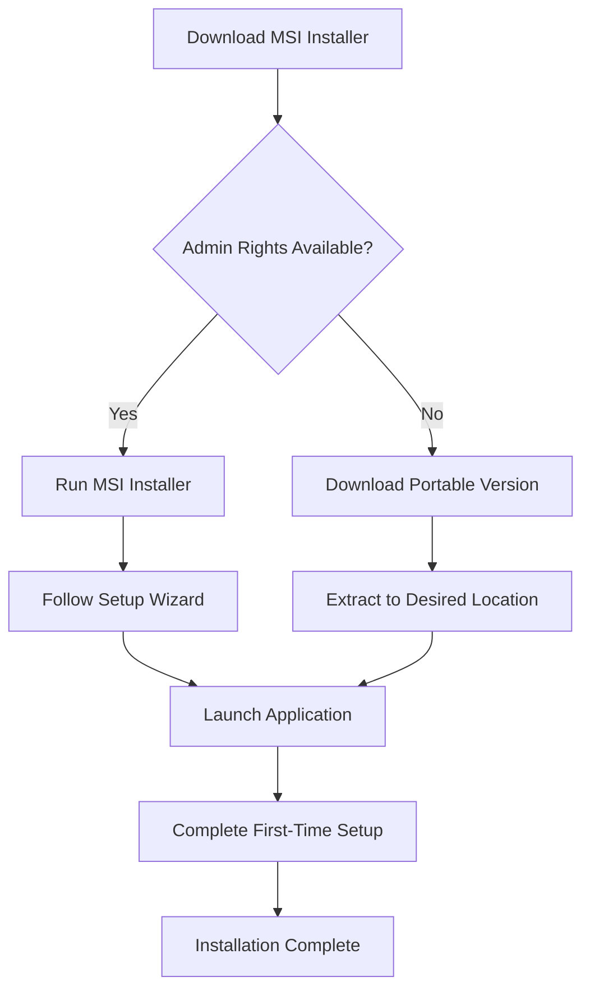
```mermaid
flowchart TD
    A[Download MSI Installer] --> B{Admin Rights Available?}
    B -->|Yes| C[Run MSI Installer]
    B -->|No| D[Download Portable Version]
    C --> E[Follow Setup Wizard]
    D --> F[Extract to Desired Location]
    E --> G[Launch Application]
    F --> G
    G --> H[Complete First-Time Setup]
    H --> I[Installation Complete]
```

**Steps:**
1. **Download Installer**
   - Visit official website
   - Download `TalosDesk-1.0.0-win64.msi`
   - Verify file integrity (SHA256 checksum)

2. **Run Installation**
   ```batch
   # Standard Installation (requires admin)
   TalosDesk-1.0.0-win64.msi
   
   # Silent Installation
   msiexec /i TalosDesk-1.0.0-win64.msi /quiet
   
   # Custom Install Path
   msiexec /i TalosDesk-1.0.0-win64.msi INSTALLDIR="C:\MyApps\TalosDesk"
   ```

3. **Alternative: Chocolatey**
   ```batch
   choco install talos-desk
   ```

4. **Alternative: Portable Installation**
   - Download `TalosDesk-1.0.0-win64-portable.zip`
   - Extract to desired folder
   - No admin rights required

**Expected Outcome:** 
- Application installed to `C:\Program Files\TalosDesk\`
- Desktop shortcut created
- System tray icon appears
- First-run configuration dialog opens

**Validation Steps:**
- ✅ Verify application starts without errors
- ✅ Check system tray shows Talos Desk icon
- ✅ Confirm configuration window opens

### 1.2 macOS Installation Workflow

**Prerequisites:**
- macOS 11.0+ (Big Sur or later)
- Intel or Apple Silicon processor
- 2GB RAM, 200MB free disk space

**Time Estimate:** 2-4 minutes

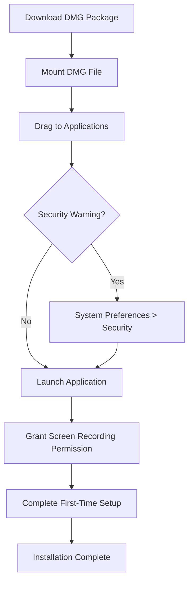
```mermaid
flowchart TD
    A[Download DMG Package] --> B[Mount DMG File]
    B --> C[Drag to Applications]
    C --> D{Security Warning?}
    D -->|Yes| E[System Preferences > Security]
    D -->|No| F[Launch Application]
    E --> F
    F --> G[Grant Screen Recording Permission]
    G --> H[Complete First-Time Setup]
    H --> I[Installation Complete]
```

**Steps:**
1. **Download and Install**
   ```bash
   # Download DMG
   curl -L -o TalosDesk-1.0.0.dmg https://releases.talosdesk.com/v1.0.0/TalosDesk-1.0.0.dmg
   
   # Mount and install
   hdiutil mount TalosDesk-1.0.0.dmg
   cp -R "/Volumes/Talos Desk/Talos Desk.app" /Applications/
   hdiutil unmount "/Volumes/Talos Desk"
   ```

2. **Alternative: Homebrew**
   ```bash
   brew install --cask talos-desk
   ```

3. **First Launch**
   - Open Applications folder
   - Double-click "Talos Desk.app"
   - Handle security prompt if needed

**Expected Outcome:**
- Application installed to `/Applications/Talos Desk.app`
- Menu bar icon appears
- Screen recording permission requested
- Configuration window opens

**Validation Steps:**
- ✅ Application launches without crashes
- ✅ Menu bar shows Talos Desk icon
- ✅ Screen recording permission granted

### 1.3 Linux Installation Workflow

**Prerequisites:**
- Ubuntu 20.04+, Fedora 34+, or Debian 11+
- X11 or Wayland display server
- 2GB RAM, 200MB free disk space

**Time Estimate:** 3-6 minutes

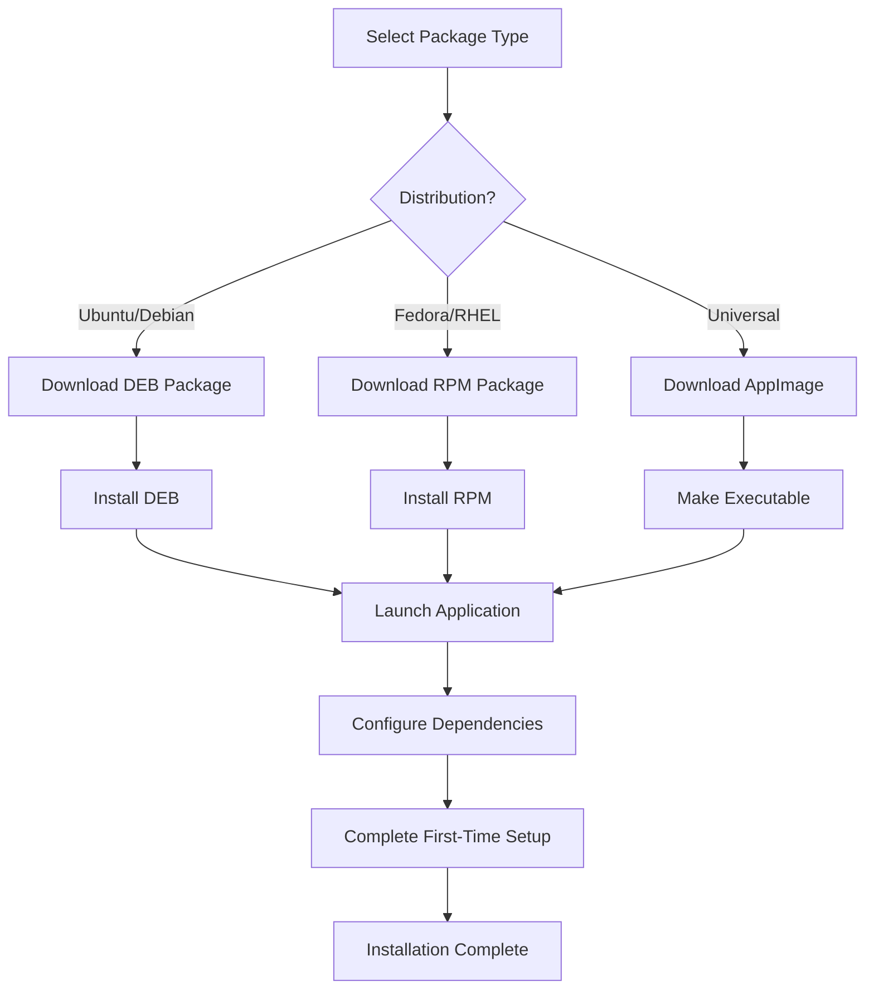
```mermaid
flowchart TD
    A[Select Package Type] --> B{Distribution?}
    B -->|Ubuntu/Debian| C[Download DEB Package]
    B -->|Fedora/RHEL| D[Download RPM Package]
    B -->|Universal| E[Download AppImage]
    C --> F[Install DEB]
    D --> G[Install RPM]
    E --> H[Make Executable]
    F --> I[Launch Application]
    G --> I
    H --> I
    I --> J[Configure Dependencies]
    J --> K[Complete First-Time Setup]
    K --> L[Installation Complete]
```

**Steps:**

**Ubuntu/Debian:**
```bash
# Download and install DEB package
wget https://releases.talosdesk.com/v1.0.0/talos-desk_1.0.0_amd64.deb
sudo dpkg -i talos-desk_1.0.0_amd64.deb
sudo apt-get install -f  # Fix dependencies if needed

# Alternative: Add repository
curl -s https://packages.talosdesk.com/key.gpg | sudo apt-key add -
echo "deb https://packages.talosdesk.com/apt stable main" | sudo tee /etc/apt/sources.list.d/talos-desk.list
sudo apt update && sudo apt install talos-desk
```

**Fedora/RHEL:**
```bash
# Download and install RPM package
wget https://releases.talosdesk.com/v1.0.0/talos-desk-1.0.0.x86_64.rpm
sudo rpm -i talos-desk-1.0.0.x86_64.rpm

# Alternative: DNF repository
sudo dnf config-manager --add-repo https://packages.talosdesk.com/rpm/talos-desk.repo
sudo dnf install talos-desk
```

**Universal: AppImage**
```bash
# Download AppImage
wget https://releases.talosdesk.com/v1.0.0/TalosDesk-1.0.0-x86_64.AppImage
chmod +x TalosDesk-1.0.0-x86_64.AppImage

# Run directly
./TalosDesk-1.0.0-x86_64.AppImage

# Optional: Install to system
sudo mv TalosDesk-1.0.0-x86_64.AppImage /usr/local/bin/talos-desk
```

**Expected Outcome:**
- Application installed to system
- Desktop file created
- System tray/notification area icon appears
- Configuration window opens

**Validation Steps:**
- ✅ Application starts without dependency errors
- ✅ System tray icon visible
- ✅ X11/Wayland screen capture works

### 1.4 First-Time Setup Workflow

**Time Estimate:** 2-3 minutes

**Universal steps for all platforms:**

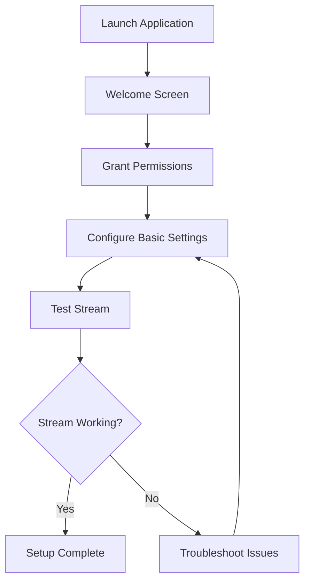
```mermaid
flowchart TD
    A[Launch Application] --> B[Welcome Screen]
    B --> C[Grant Permissions]
    C --> D[Configure Basic Settings]
    D --> E[Test Stream]
    E --> F{Stream Working?}
    F -->|Yes| G[Setup Complete]
    F -->|No| H[Troubleshoot Issues]
    H --> D
```

**Steps:**
1. **Welcome Screen**
   - Review system requirements
   - Accept license agreement
   - Choose installation mode (Standard/Advanced)

2. **Permission Grants**
   - **Windows:** Allow through Windows Firewall
   - **macOS:** Grant Screen Recording permission
   - **Linux:** Allow access to X11/Wayland

3. **Basic Configuration**
   - Set RTSP port (default: 554)
   - Choose video quality preset
   - Set authentication (optional)

4. **Test Stream**
   - Start streaming
   - Verify RTSP URL accessibility
   - Test with VLC or similar client

**Configuration File Initialization:**
```json
{
  "version": "1.0.0",
  "video": {
    "codec": "h264",
    "framerate": 30,
    "bitrate": 8000,
    "quality_preset": "balanced",
    "resolution": "native"
  },
  "network": {
    "rtsp_port": 554,
    "authentication": {
      "enabled": false,
      "type": "digest"
    }
  },
  "capture": {
    "monitor": "primary",
    "cursor": true,
    "privacy_mask": false
  },
  "performance": {
    "hardware_acceleration": "auto",
    "thread_count": "auto"
  }
}
```

---

## Configuration Workflows

### 2.1 Initial Configuration Workflow

**Time Estimate:** 5-10 minutes

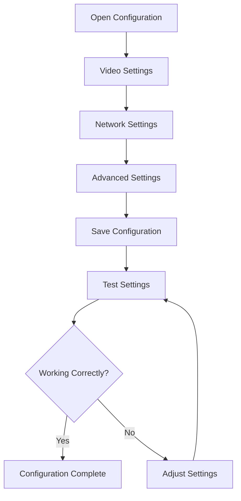
```mermaid
flowchart TD
    A[Open Configuration] --> B[Video Settings]
    B --> C[Network Settings]
    C --> D[Advanced Settings]
    D --> E[Save Configuration]
    E --> F[Test Settings]
    F --> G{Working Correctly?}
    G -->|Yes| H[Configuration Complete]
    G -->|No| I[Adjust Settings]
    I --> F
```

**Steps:**

1. **Open Configuration Interface**
   - Right-click system tray icon
   - Select "Settings" or "Configuration"
   - Or launch desktop application directly

2. **Configure Video Settings**
   ```yaml
   Codec Selection:
     - H.264 (Most Compatible) ✓
     - H.265 (Better Compression)
   
   Resolution:
     - Always Native (Automatic) ✓
     - Custom scaling not recommended
   
   Frame Rate:
     - 15 fps (Low bandwidth)
     - 30 fps (Standard) ✓
     - 60 fps (High quality)
   
   Bitrate:
     - 2000 Kbps (Low bandwidth)
     - 8000 Kbps (Balanced) ✓
     - 15000 Kbps (High quality)
   
   Quality Preset:
     - High Quality (Higher CPU)
     - Balanced (Recommended) ✓
     - Low Bandwidth (Lower quality)
   ```

3. **Configure Network Settings**
   ```yaml
   RTSP Port:
     - Default: 554 ✓
     - Alternative: 8554 (non-privileged)
     - Custom: User-defined
   
   Authentication:
     - None (Not recommended for production)
     - Digest Authentication ✓
     - Username/Password setup
   
   Access Control:
     - IP Whitelist (Optional)
     - Rate Limiting (Default: enabled)
   ```

4. **Advanced Settings**
   ```yaml
   Hardware Acceleration:
     - Auto-detect (Recommended) ✓
     - Force specific encoder
     - Disable (CPU only)
   
   Multi-Monitor:
     - Primary monitor only ✓
     - Specific monitor selection
     - All monitors (future feature)
   
   Privacy Features:
     - Privacy masking regions
     - Cursor capture toggle
     - Sensitive area blurring
   ```

### 2.2 Video Quality Configuration Workflow

**Purpose:** Optimize video quality for specific use cases
**Time Estimate:** 3-5 minutes

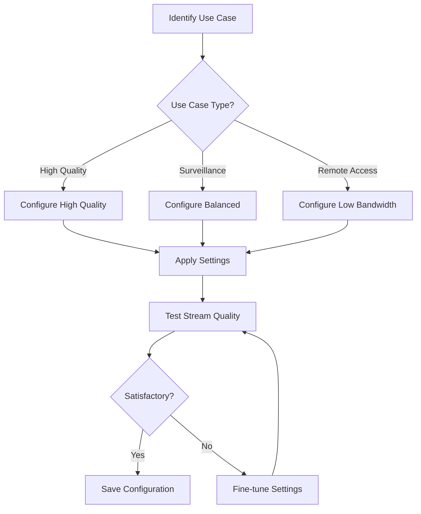
```mermaid
flowchart TD
    A[Identify Use Case] --> B{Use Case Type?}
    B -->|High Quality| C[Configure High Quality]
    B -->|Surveillance| D[Configure Balanced]
    B -->|Remote Access| E[Configure Low Bandwidth]
    C --> F[Apply Settings]
    D --> F
    E --> F
    F --> G[Test Stream Quality]
    G --> H{Satisfactory?}
    H -->|Yes| I[Save Configuration]
    H -->|No| J[Fine-tune Settings]
    J --> G
```

**Preset Configurations:**

**High Quality (Presentations/Demos):**
```json
{
  "codec": "h265",
  "framerate": 60,
  "bitrate": 15000,
  "quality_preset": "high_quality",
  "hardware_acceleration": true
}
```

**Balanced (General Monitoring):**
```json
{
  "codec": "h264",
  "framerate": 30,
  "bitrate": 8000,
  "quality_preset": "balanced",
  "hardware_acceleration": "auto"
}
```

**Low Bandwidth (Remote Locations):**
```json
{
  "codec": "h264",
  "framerate": 15,
  "bitrate": 2000,
  "quality_preset": "low_bandwidth",
  "hardware_acceleration": true
}
```

### 2.3 Network Configuration Workflow

**Purpose:** Set up network access and security
**Time Estimate:** 10-15 minutes

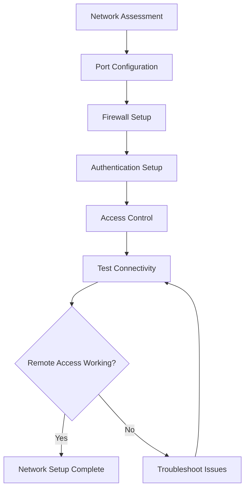
```mermaid
flowchart TD
    A[Network Assessment] --> B[Port Configuration]
    B --> C[Firewall Setup]
    C --> D[Authentication Setup]
    D --> E[Access Control]
    E --> F[Test Connectivity]
    F --> G{Remote Access Working?}
    G -->|Yes| H[Network Setup Complete]
    G -->|No| I[Troubleshoot Issues]
    I --> F
```

**Steps:**

1. **Port Configuration**
   ```yaml
   Standard RTSP Port: 554
   - Requires admin/root privileges
   - Industry standard for RTSP
   - Compatible with all VMS systems
   
   Alternative Port: 8554
   - No special privileges required
   - Good for testing and development
   - May require manual VMS configuration
   
   Custom Port: User-defined
   - Any available port 1024-65535
   - Document for VMS integration
   - Ensure firewall compatibility
   ```

2. **Firewall Configuration**
   
   **Windows:**
   ```batch
   # Allow RTSP through Windows Firewall
   netsh advfirewall firewall add rule name="Talos Desk RTSP" dir=in action=allow protocol=TCP localport=554
   
   # For UDP (if using UDP transport)
   netsh advfirewall firewall add rule name="Talos Desk RTP" dir=in action=allow protocol=UDP localport=10000-20000
   ```

   **macOS:**
   ```bash
   # macOS firewall typically allows outbound connections
   # For advanced firewall (pfctl), consult network administrator
   ```

   **Linux (UFW):**
   ```bash
   # Allow RTSP port
   sudo ufw allow 554/tcp
   
   # Allow RTP range for UDP
   sudo ufw allow 10000:20000/udp
   ```

3. **Authentication Setup**
   ```yaml
   Recommended Setup:
     Username: admin
     Password: [Generate strong password]
     Authentication Type: Digest
     
   Security Best Practices:
     - Use strong passwords (12+ characters)
     - Change default credentials
     - Enable authentication for production
     - Regular password rotation
   ```

---

## Operational Workflows

### 3.1 Starting/Stopping Streams Workflow

**Time Estimate:** 1-2 minutes

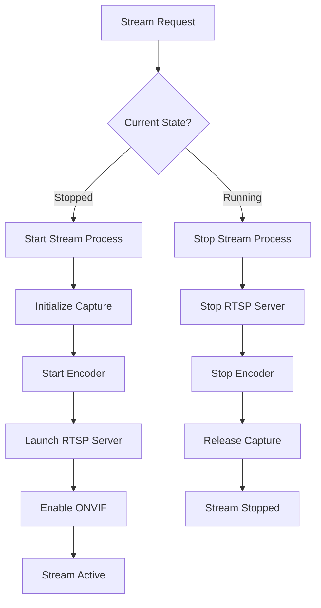
```mermaid
flowchart TD
    A[Stream Request] --> B{Current State?}
    B -->|Stopped| C[Start Stream Process]
    B -->|Running| D[Stop Stream Process]
    C --> E[Initialize Capture]
    E --> F[Start Encoder]
    F --> G[Launch RTSP Server]
    G --> H[Enable ONVIF]
    H --> I[Stream Active]
    D --> J[Stop RTSP Server]
    J --> K[Stop Encoder]
    K --> L[Release Capture]
    L --> M[Stream Stopped]
```

**Starting Stream:**

1. **Via System Tray**
   - Right-click tray icon
   - Select "Start Streaming"
   - Confirm in notification

2. **Via Desktop Application**
   - Open configuration window
   - Click "Start Stream" button
   - Monitor status indicators

3. **Via Command Line**
   ```bash
   # Start streaming with current config
   talos-desk --start
   
   # Start with specific configuration
   talos-desk --start --config /path/to/config.json
   
   # Start with custom settings
   talos-desk --start --port 8554 --bitrate 5000
   ```

**Status Indicators:**
- 🔴 **Red:** Stream stopped/error
- 🟡 **Yellow:** Starting/stopping
- 🟢 **Green:** Stream active
- 🔵 **Blue:** Configuration mode

**Validation Steps:**
- ✅ Tray icon shows green/active status
- ✅ RTSP URL accessible via VLC
- ✅ No error messages in logs

### 3.2 System Tray Operations Workflow

**Purpose:** Quick access to common functions
**Time Estimate:** 30 seconds - 2 minutes

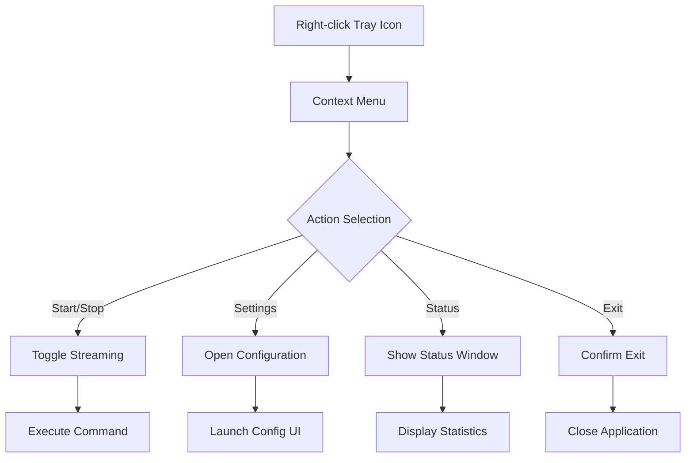
```mermaid
flowchart TD
    A[Right-click Tray Icon] --> B[Context Menu]
    B --> C{Action Selection}
    C -->|Start/Stop| D[Toggle Streaming]
    C -->|Settings| E[Open Configuration]
    C -->|Status| F[Show Status Window]
    C -->|Exit| G[Confirm Exit]
    D --> H[Execute Command]
    E --> I[Launch Config UI]
    F --> J[Display Statistics]
    G --> K[Close Application]
```

**Available Actions:**

```yaml
Context Menu Options:
  - Stream Status: "🟢 Streaming" or "🔴 Stopped"
  - Start Streaming / Stop Streaming (toggle)
  - Open Settings
  - View Stream (opens RTSP URL in default player)
  - Show Statistics
  - Recent Logs
  - Help & Documentation
  - Exit Application

Quick Actions:
  - Double-click: Toggle streaming
  - Middle-click: Open settings
  - Ctrl+click: Show statistics
```

**Status Information Display:**
```yaml
Stream Statistics:
  Status: Active/Inactive
  Uptime: 02:34:15
  Clients Connected: 3
  Current FPS: 30.2
  Bitrate: 8.1 Mbps
  CPU Usage: 12.3%
  Memory Usage: 156 MB
  Network Sent: 2.1 GB
```

### 3.3 Desktop UI Navigation Workflow

**Purpose:** Comprehensive configuration and monitoring
**Time Estimate:** 5-15 minutes

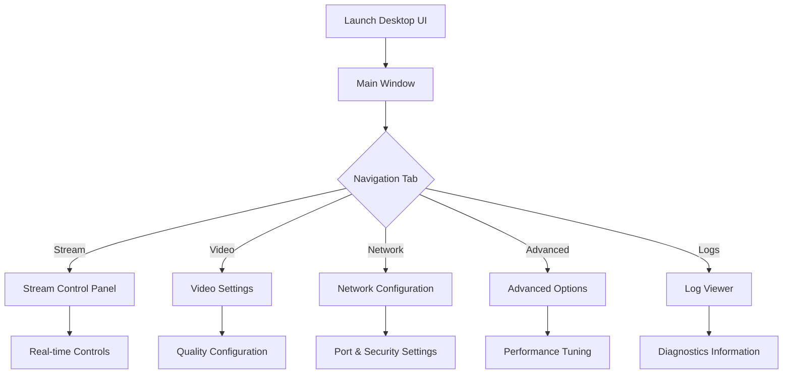
```mermaid
flowchart TD
    A[Launch Desktop UI] --> B[Main Window]
    B --> C{Navigation Tab}
    C -->|Stream| D[Stream Control Panel]
    C -->|Video| E[Video Settings]
    C -->|Network| F[Network Configuration]
    C -->|Advanced| G[Advanced Options]
    C -->|Logs| H[Log Viewer]
    D --> I[Real-time Controls]
    E --> J[Quality Configuration]
    F --> K[Port & Security Settings]
    G --> L[Performance Tuning]
    H --> M[Diagnostics Information]
```

**Interface Layout:**

1. **Stream Control Panel**
   ```yaml
   Current Status:
     - Stream URL: rtsp://192.168.1.100:554/stream
     - Status: 🟢 STREAMING
     - Uptime: 01:23:45
     - Clients: 2 connected
   
   Controls:
     - [Start Stream] / [Stop Stream]
     - [Test Stream] (opens in VLC)
     - [Copy RTSP URL]
     - [Save Current Settings]
   
   Real-time Statistics:
     - FPS: 30.1 ± 0.2
     - Bitrate: 8.2 Mbps
     - CPU: 11.8%
     - Memory: 145 MB
   ```

2. **Video Settings Tab**
   ```yaml
   Codec Configuration:
     Codec: [H.264 ▼] [H.265]
     Profile: [High ▼] [Main] [Baseline]
     Level: [4.2 ▼] [Auto-detect]
   
   Quality Settings:
     Resolution: 1920x1080 (Native - Read Only)
     Frame Rate: [30 fps ▼] [15] [60]
     Bitrate: [8000] Kbps (1000-50000)
     Quality: [Balanced ▼] [High] [Low Bandwidth]
   
   Hardware Acceleration:
     ☑ Enable Hardware Acceleration
     Device: [NVIDIA GTX 1060 ▼] [Auto-detect]
     Features: NVENC H.264/H.265 ✓
   ```

3. **Network Configuration Tab**
   ```yaml
   RTSP Server:
     Port: [554] (Requires restart)
     Transport: ☑ TCP ☑ UDP
     Max Clients: [10] (1-100)
   
   Authentication:
     ☑ Enable Authentication
     Type: [Digest ▼] [Basic]
     Username: [admin]
     Password: [••••••••] [Generate]
   
   Access Control:
     ☑ Enable IP Filtering
     Whitelist: [192.168.1.0/24] [Add]
     Rate Limiting: [100] requests/minute
   ```

---

## Integration Workflows

### 4.1 VMS Discovery and Setup Workflow

**Time Estimate:** 10-20 minutes per VMS

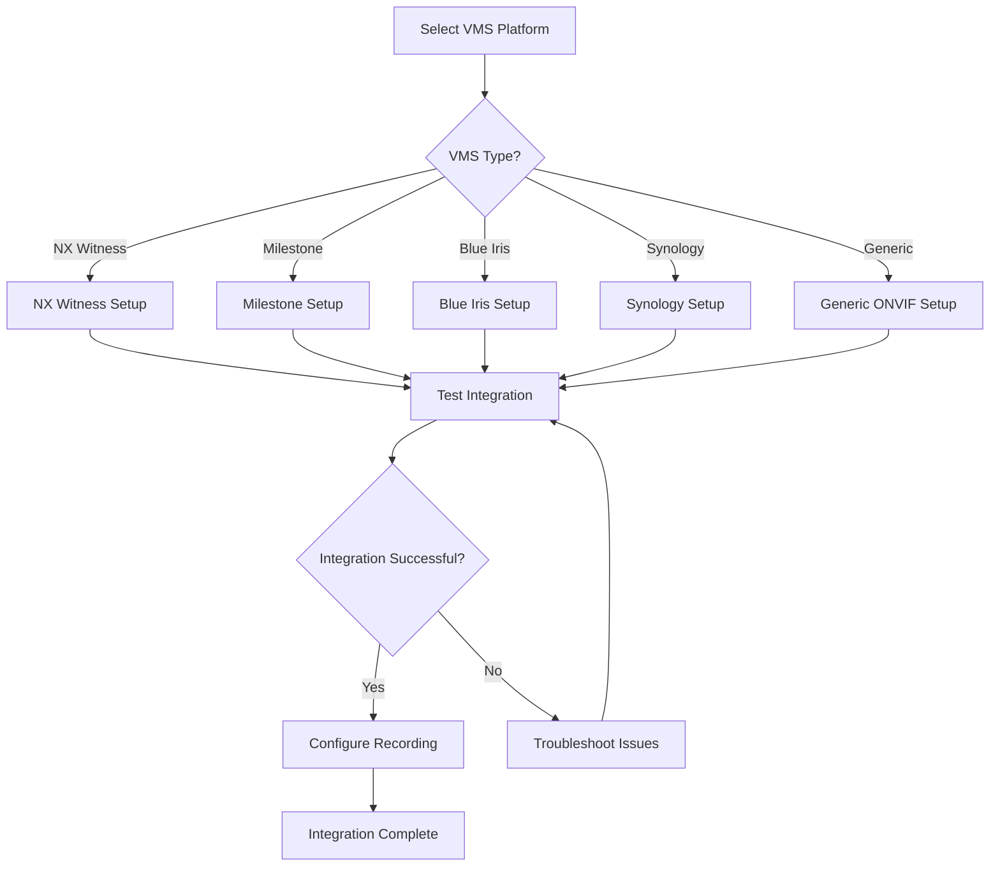
```mermaid
flowchart TD
    A[Select VMS Platform] --> B{VMS Type?}
    B -->|NX Witness| C[NX Witness Setup]
    B -->|Milestone| D[Milestone Setup]
    B -->|Blue Iris| E[Blue Iris Setup]
    B -->|Synology| F[Synology Setup]
    B -->|Generic| G[Generic ONVIF Setup]
    C --> H[Test Integration]
    D --> H
    E --> H
    F --> H
    G --> H
    H --> I{Integration Successful?}
    I -->|Yes| J[Configure Recording]
    I -->|No| K[Troubleshoot Issues]
    K --> H
    J --> L[Integration Complete]
```

### 4.2 NX Witness Integration Workflow

**Prerequisites:**
- NX Witness Server running
- Network connectivity between Talos Desk and NX Witness
- Talos Desk streaming active

**Steps:**

1. **Enable ONVIF Discovery**
   ```yaml
   Talos Desk Configuration:
     ONVIF Service: Enabled
     WS-Discovery: Enabled
     Port 554: Open and accessible
   ```

2. **Add Device in NX Witness**
   ```yaml
   Method 1 - Automatic Discovery:
     1. Open NX Witness Client
     2. Go to System Administration
     3. Select "Cameras and I/O Modules"
     4. Click "Auto-Discovery"
     5. Wait for Talos Desk to appear
     6. Select and configure
   
   Method 2 - Manual Addition:
     1. Click "Add Camera"
     2. Select "Network Camera"
     3. Enter IP address of Talos Desk host
     4. Port: 554
     5. Protocol: ONVIF
     6. Test connection
   ```

3. **Configuration in NX Witness**
   ```yaml
   Camera Settings:
     Name: "Desktop - [Computer Name]"
     URL: rtsp://[IP]:554/stream
     Protocol: ONVIF
     Vendor: Generic ONVIF
     
   Recording Settings:
     Quality: High
     FPS: Match source (30)
     Archive Location: [Select storage]
     Motion Detection: Enable if desired
   ```

**Expected Results:**
- Camera appears in resource tree
- Live view displays desktop content
- Recording functions normally
- Motion detection works (if enabled)

### 4.3 Milestone XProtect Integration Workflow

**Steps:**

1. **Add Hardware in Milestone**
   ```yaml
   Management Client Steps:
     1. Open Management Client
     2. Expand Site Navigation
     3. Right-click "Recording Servers"
     4. Select "Add Hardware"
     5. Choose "Express Scan" or "Manual"
   
   Express Scan:
     - Enter IP range containing Talos Desk
     - Select ONVIF driver
     - Follow wizard
   
   Manual Addition:
     - Driver: ONVIF
     - Address: [Talos Desk IP]
     - Port: 554
     - Credentials: [if authentication enabled]
   ```

2. **Device Configuration**
   ```yaml
   Camera Properties:
     Name: Desktop Camera - [Location]
     Enabled: Yes
     Recording: Enabled
     
   Streams:
     Stream 1: Main stream (high quality)
     Recording Quality: Match source
     Live Quality: Medium (for bandwidth)
   ```

### 4.4 Blue Iris Integration Workflow

**Steps:**

1. **Add Camera in Blue Iris**
   ```yaml
   Camera Setup:
     1. Right-click in camera list
     2. Select "Add new camera"
     3. Choose "Network IP"
     
   Network Configuration:
     Make: Generic ONVIF
     Model: [Auto-detect or Generic]
     IP Address: [Talos Desk host IP]
     Port: 554
     Username/Password: [if configured]
   ```

2. **Stream Configuration**
   ```yaml
   Video Tab:
     Main Stream: rtsp://[IP]:554/stream
     Sub Stream: [Same as main for single stream]
     
   Record Tab:
     Format: MP4
     Quality: Match source
     Trigger: Continuous + motion
   ```

### 4.5 Synology Surveillance Station Integration

**Steps:**

1. **Add IP Camera**
   ```yaml
   IP Camera Setup:
     1. Open Surveillance Station
     2. Go to Camera > Add Camera
     3. Select "Add IP Camera"
     
   Camera Information:
     Name: Desktop - [Computer Name]
     Address: [Talos Desk IP]
     Port: 554
     Brand: User-defined
     Model: ONVIF Camera
   ```

2. **Configure Recording**
   ```yaml
   Recording Settings:
     Resolution: Source resolution
     Quality: High
     FPS: 30
     Schedule: 24/7 or custom
     
   Storage:
     Volume: [Select appropriate volume]
     Retention: [Set according to policy]
   ```

### 4.6 Generic ONVIF Setup Workflow

**For VMS systems not specifically covered:**

1. **Gather Information**
   ```yaml
   Required Details:
     IP Address: [Talos Desk host]
     Port: 554
     Protocol: ONVIF/RTSP
     Stream URL: rtsp://[IP]:554/stream
     
   Optional:
     Username: [if authentication enabled]
     Password: [if authentication enabled]
     ONVIF Port: 80 (for device discovery)
   ```

2. **Add Generic ONVIF Device**
   ```yaml
   Common Steps:
     1. Look for "Add Camera" or "Add Device"
     2. Select "Network Camera" or "IP Camera"
     3. Choose "ONVIF" as protocol
     4. Enter connection details
     5. Test connection
     6. Configure recording settings
   ```

**ONVIF Compliance Verification:**
```bash
# Test ONVIF discovery
curl -s "http://[TALOS_DESK_IP]/onvif/device_service" \
  -H "Content-Type: application/soap+xml" \
  -d '<?xml version="1.0" encoding="UTF-8"?>
      <soap:Envelope>
        <soap:Body>
          <tds:GetDeviceInformation/>
        </soap:Body>
      </soap:Envelope>'
```

---

## Monitoring Workflows

### 5.1 Real-time Performance Monitoring Workflow

**Purpose:** Monitor system performance and stream health
**Time Estimate:** Ongoing monitoring

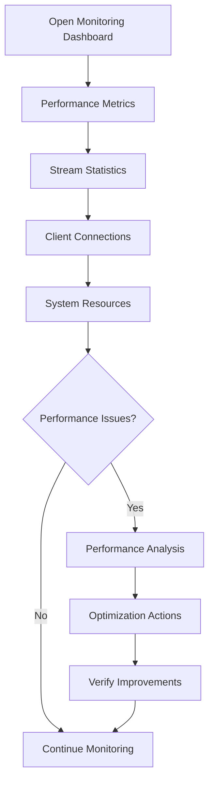
```mermaid
flowchart TD
    A[Open Monitoring Dashboard] --> B[Performance Metrics]
    B --> C[Stream Statistics]
    C --> D[Client Connections]
    D --> E[System Resources]
    E --> F{Performance Issues?}
    F -->|Yes| G[Performance Analysis]
    F -->|No| H[Continue Monitoring]
    G --> I[Optimization Actions]
    I --> J[Verify Improvements]
    J --> H
```

**Key Performance Indicators (KPIs):**

1. **Stream Health Metrics**
   ```yaml
   Critical Metrics:
     Stream Status: Active/Inactive
     Actual FPS: 29.8-30.2 (target: 30)
     Frame Drops: <1% acceptable
     Encoding Latency: <100ms
     Bitrate Stability: ±5% variation
   
   Quality Indicators:
     Resolution: Native (no scaling)
     Codec Profile: Matches configuration
     Keyframe Interval: Consistent
     Error Rate: <0.1%
   ```

2. **System Resource Monitoring**
   ```yaml
   Resource Usage:
     CPU Usage: <15% (target)
     Memory Usage: <200MB (target)
     GPU Usage: <50% (if hardware acceleration)
     Network Bandwidth: Match bitrate setting
   
   Performance Thresholds:
     CPU Warning: >20%
     CPU Critical: >30%
     Memory Warning: >300MB
     Memory Critical: >500MB
   ```

3. **Network Performance**
   ```yaml
   Network Metrics:
     Throughput: Match configured bitrate
     Packet Loss: <0.01%
     Latency: <50ms to clients
     Concurrent Connections: Track active clients
   
   Connection Quality:
     TCP Connections: Stable
     UDP Packet Loss: Minimal
     Retransmission Rate: <1%
   ```

**Monitoring Dashboard Layout:**
```yaml
Real-time Display:
  Stream Status: 🟢 ACTIVE | Uptime: 04:23:16
  Performance:
    CPU: [████████░░] 12.3%
    Memory: [██████░░░░] 156MB/200MB target
    FPS: 30.1 ± 0.2
    Bitrate: 8.2 Mbps (target: 8.0)
  
  Clients: 3 connected
    - VMS-Server-01: 192.168.1.10 (TCP) ✓
    - Viewer-Laptop: 192.168.1.25 (UDP) ✓
    - Mobile-App: 10.0.0.5 (TCP) ✓
  
  Recent Events:
    14:23:15 - Client connected: 192.168.1.25
    14:20:03 - Encoding quality adjusted: auto
    14:15:42 - Stream started successfully
```

### 5.2 Client Connection Management Workflow

**Purpose:** Track and manage connected clients
**Time Estimate:** 2-5 minutes per client issue

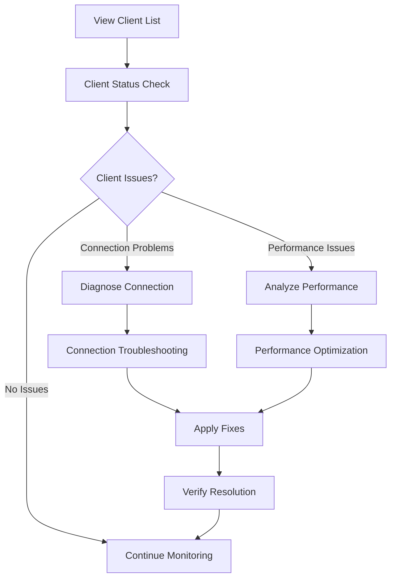
```mermaid
flowchart TD
    A[View Client List] --> B[Client Status Check]
    B --> C{Client Issues?}
    C -->|Connection Problems| D[Diagnose Connection]
    C -->|Performance Issues| E[Analyze Performance]
    C -->|No Issues| F[Continue Monitoring]
    D --> G[Connection Troubleshooting]
    E --> H[Performance Optimization]
    G --> I[Apply Fixes]
    H --> I
    I --> J[Verify Resolution]
    J --> F
```

**Client Management Interface:**
```yaml
Connected Clients Display:
  Client 1:
    IP: 192.168.1.10
    Hostname: vms-server-01
    Connection: TCP
    Duration: 04:15:23
    Bandwidth: 8.1 Mbps
    Status: ✓ Healthy
    Actions: [Disconnect] [View Details]
  
  Client 2:
    IP: 192.168.1.25
    Hostname: laptop-viewer
    Connection: UDP
    Duration: 00:23:45
    Bandwidth: 7.8 Mbps
    Status: ⚠ High Packet Loss (2.3%)
    Actions: [Disconnect] [View Details] [Troubleshoot]
```

**Client Troubleshooting Steps:**
1. **Connection Issues**
   ```yaml
   Diagnostic Steps:
     - Verify IP connectivity (ping)
     - Check firewall rules
     - Validate RTSP authentication
     - Test with alternative client
   
   Common Solutions:
     - Restart client connection
     - Switch TCP/UDP transport
     - Adjust authentication settings
     - Check network configuration
   ```

2. **Performance Issues**
   ```yaml
   Analysis Points:
     - Bandwidth consumption vs. configured
     - Packet loss percentage
     - Connection stability
     - Client-side decoding performance
   
   Optimization Actions:
     - Reduce bitrate for specific client
     - Switch to more compatible codec
     - Adjust quality settings
     - Recommend client upgrades
   ```

### 5.3 Resource Usage Tracking Workflow

**Purpose:** Monitor and optimize system resource consumption
**Time Estimate:** 5-10 minutes for analysis

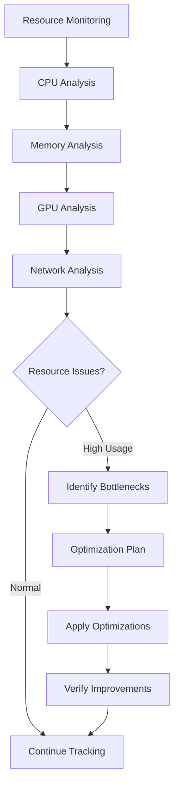
```mermaid
flowchart TD
    A[Resource Monitoring] --> B[CPU Analysis]
    B --> C[Memory Analysis]
    C --> D[GPU Analysis]
    D --> E[Network Analysis]
    E --> F{Resource Issues?}
    F -->|High Usage| G[Identify Bottlenecks]
    F -->|Normal| H[Continue Tracking]
    G --> I[Optimization Plan]
    I --> J[Apply Optimizations]
    J --> K[Verify Improvements]
    K --> H
```

**Resource Tracking Dashboard:**
```yaml
System Performance Overview:
  Current Load:
    CPU Usage: 12.3% (4 cores @ 3.2GHz)
    Memory: 156MB / 16GB total (0.97%)
    GPU: 15% NVENC utilization
    Disk I/O: Minimal (config writes only)
  
  Performance History (Last Hour):
    CPU: ████████░░ Avg: 13.1% Peak: 18.7%
    Memory: ███░░░░░░░ Avg: 145MB Peak: 198MB
    Network: ████████░░ Avg: 8.2Mbps Peak: 12.1Mbps
  
  Resource Efficiency:
    CPU per client: 4.1% (target: <5%)
    Memory per client: 52MB (target: <67MB)
    Encoding efficiency: 98.7% (excellent)
```

**Optimization Recommendations:**
```yaml
Automatic Optimizations:
  - Hardware acceleration: ✓ NVENC active
  - Thread optimization: ✓ 4 encoding threads
  - Memory pooling: ✓ Zero-copy pipeline
  - Frame rate adaptation: Ready if needed

Manual Optimizations Available:
  - Reduce frame rate to 24fps: Save 20% CPU
  - Lower bitrate to 6Mbps: Save 25% bandwidth
  - Disable cursor capture: Save 5% CPU
  - Use faster encoding preset: Save 15% CPU (quality impact)
```

---

## Troubleshooting Workflows

### 6.1 Common Issues Resolution Workflow

**Time Estimate:** 5-30 minutes depending on issue complexity

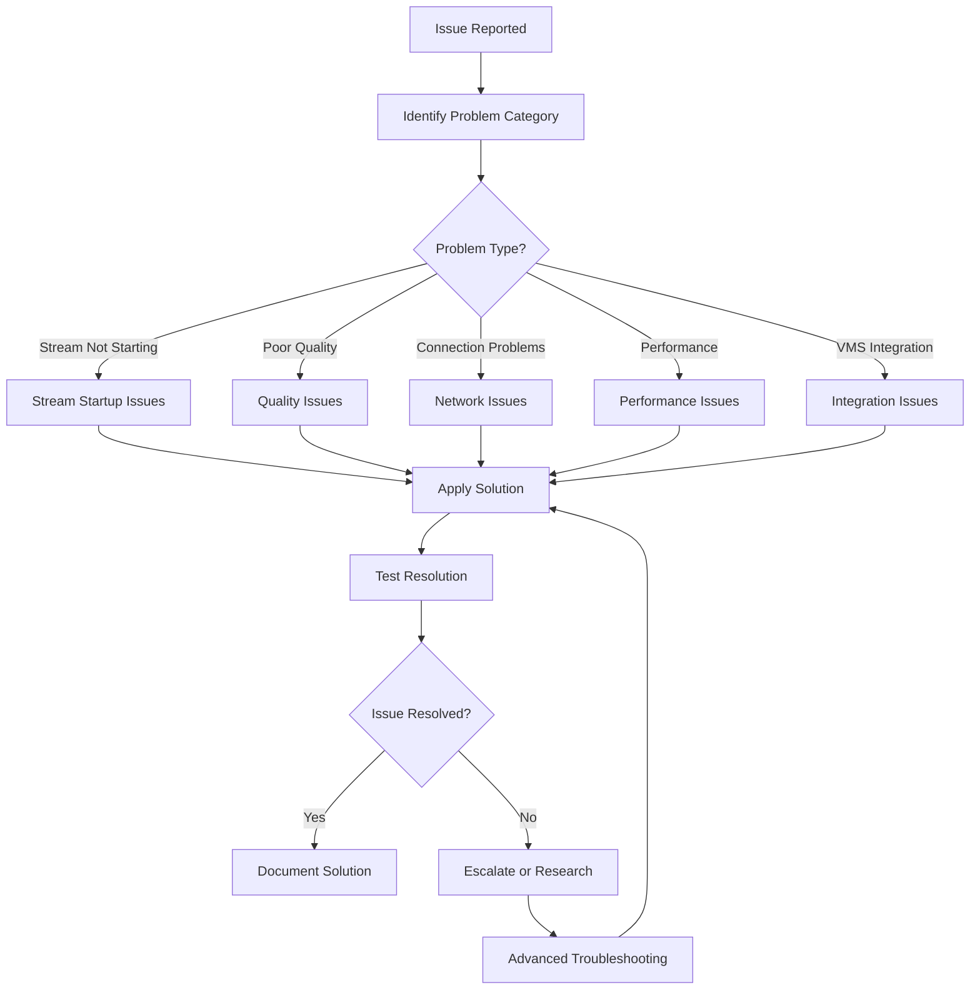
```mermaid
flowchart TD
    A[Issue Reported] --> B[Identify Problem Category]
    B --> C{Problem Type?}
    C -->|Stream Not Starting| D[Stream Startup Issues]
    C -->|Poor Quality| E[Quality Issues]
    C -->|Connection Problems| F[Network Issues]
    C -->|Performance| G[Performance Issues]
    C -->|VMS Integration| H[Integration Issues]
    D --> I[Apply Solution]
    E --> I
    F --> I
    G --> I
    H --> I
    I --> J[Test Resolution]
    J --> K{Issue Resolved?}
    K -->|Yes| L[Document Solution]
    K -->|No| M[Escalate or Research]
    M --> N[Advanced Troubleshooting]
    N --> I
```

### 6.2 Stream Not Starting Issues

**Common Symptoms:**
- Application launches but stream doesn't start
- Error messages in logs
- Tray icon remains red/inactive

**Diagnostic Steps:**

1. **Check System Permissions**
   ```yaml
   Windows:
     - Screen capture permissions
     - Windows Firewall exceptions
     - Antivirus software blocking
   
   macOS:
     - Screen Recording permission in Security & Privacy
     - Accessibility permissions if needed
     - Network permissions for listening
   
   Linux:
     - X11/Wayland access permissions
     - Display server connection
     - Port binding permissions
   ```

2. **Port Availability Check**
   ```bash
   # Check if RTSP port is available
   netstat -an | grep :554
   
   # Windows
   netstat -an | findstr :554
   
   # Test port accessibility
   telnet localhost 554
   ```

3. **Screen Capture Validation**
   ```yaml
   Test Screen Capture:
     - Try capturing screenshot manually
     - Check display drivers are updated
     - Verify no other capture software conflicts
     - Test with different display configurations
   ```

**Solutions:**

1. **Permission Issues**
   ```yaml
   Windows:
     - Run as administrator once to register
     - Add firewall exception manually
     - Temporarily disable antivirus for testing
   
   macOS:
     - System Preferences > Security > Privacy > Screen Recording
     - Add Talos Desk to allowed applications
     - Restart application after permission grant
   
   Linux:
     - Check DISPLAY environment variable
     - Verify X11 socket permissions
     - Test with xhost +localhost (temporary)
   ```

2. **Port Conflicts**
   ```yaml
   Solutions:
     - Change RTSP port to 8554 (non-privileged)
     - Stop conflicting services
     - Use port forwarding if needed
     - Configure alternative port in VMS
   ```

### 6.3 Quality Issues Troubleshooting

**Common Symptoms:**
- Blurry or pixelated video
- Low frame rate
- Color issues
- Encoding artifacts

**Diagnostic Process:**

1. **Quality Assessment**
   ```yaml
   Checklist:
     Current Resolution: [Check against native]
     Frame Rate: [Actual vs configured]
     Bitrate: [Actual vs configured]
     Codec Settings: [Profile, level, preset]
     Hardware Acceleration: [Active/inactive]
   ```

2. **Performance Analysis**
   ```yaml
   Resource Check:
     CPU Usage: >30% indicates overload
     Memory Usage: >500MB indicates leak
     GPU Usage: Check hardware encoder
     Frame Drops: >1% indicates bottleneck
   ```

**Solutions:**

1. **Quality Optimization**
   ```yaml
   Immediate Actions:
     - Increase bitrate (test up to 15Mbps)
     - Change codec profile to "high"
     - Enable hardware acceleration
     - Adjust encoding preset to "slower"
   
   Hardware Improvements:
     - Update graphics drivers
     - Enable GPU hardware acceleration
     - Add more RAM if memory limited
     - Close resource-intensive applications
   ```

2. **Encoder Configuration**
   ```yaml
   H.264 Optimization:
     Profile: High (best quality)
     Level: 4.2 (supports high bitrates)
     B-frames: 2 (better compression)
     Reference frames: 3 (higher quality)
   
   H.265 Optimization:
     Profile: Main (good compatibility)
     Tier: High (better performance)
     CRF: 23 (balance quality/size)
   ```

### 6.4 Network Connectivity Testing

**Purpose:** Diagnose and resolve network-related issues
**Time Estimate:** 10-20 minutes

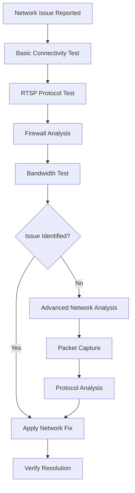
```mermaid
flowchart TD
    A[Network Issue Reported] --> B[Basic Connectivity Test]
    B --> C[RTSP Protocol Test]
    C --> D[Firewall Analysis]
    D --> E[Bandwidth Test]
    E --> F{Issue Identified?}
    F -->|Yes| G[Apply Network Fix]
    F -->|No| H[Advanced Network Analysis]
    G --> I[Verify Resolution]
    H --> J[Packet Capture]
    J --> K[Protocol Analysis]
    K --> G
```

**Network Diagnostic Commands:**

1. **Basic Network Tests**
   ```bash
   # Test basic connectivity
   ping [TALOS_DESK_IP]
   
   # Test RTSP port accessibility
   telnet [TALOS_DESK_IP] 554
   
   # Check local network configuration
   ipconfig /all  # Windows
   ifconfig -a    # Linux/macOS
   ```

2. **RTSP Protocol Testing**
   ```bash
   # Test RTSP stream with cURL
   curl -v rtsp://[IP]:554/stream
   
   # Test with VLC command line
   vlc --intf dummy rtsp://[IP]:554/stream --run-time=10 --stop-time=10
   
   # Test with FFplay
   ffplay rtsp://[IP]:554/stream
   ```

3. **Bandwidth Testing**
   ```bash
   # Monitor network usage during streaming
   iftop -i [interface]
   
   # Windows network monitoring
   netstat -e
   
   # Check for packet loss
   ping -t [IP]  # Windows
   ping [IP]     # Linux/macOS
   ```

**Network Solutions:**

1. **Firewall Configuration**
   ```yaml
   Windows Firewall:
     - Windows Defender Firewall > Allow an app
     - Add Talos Desk to exceptions
     - Enable for both Private and Public networks
   
   Router/Switch Configuration:
     - Port forwarding for remote access
     - QoS settings for video traffic
     - VLAN configuration if applicable
   ```

2. **Performance Optimization**
   ```yaml
   Network Optimization:
     - Use wired connection instead of Wi-Fi
     - Configure QoS for video traffic priority
     - Adjust TCP/UDP buffer sizes
     - Enable jumbo frames for gigabit networks
   
   Bandwidth Management:
     - Limit bitrate based on network capacity
     - Use adaptive bitrate if available
     - Monitor network congestion
     - Implement traffic shaping
   ```

### 6.5 VMS Compatibility Checks

**Purpose:** Resolve VMS integration issues
**Time Estimate:** 15-30 minutes

**Common VMS Issues:**
1. **Device Not Discovered**
   ```yaml
   Troubleshooting Steps:
     - Verify ONVIF service is running
     - Check WS-Discovery responses
     - Validate network multicast
     - Try manual device addition
   
   ONVIF Discovery Test:
     curl -X POST http://239.255.255.250:3702 \
       -H "Content-Type: application/soap+xml" \
       -d "[WS-Discovery Probe Message]"
   ```

2. **Authentication Failures**
   ```yaml
   Solutions:
     - Verify username/password in VMS
     - Check authentication type (Basic/Digest)
     - Validate ONVIF authentication tokens
     - Try disabling authentication temporarily
   ```

3. **Stream Format Issues**
   ```yaml
   Compatibility Checks:
     - Codec support (H.264 vs H.265)
     - Profile compatibility (Baseline/Main/High)
     - Resolution support in VMS
     - Frame rate limitations
   
   Solutions:
     - Switch to H.264 for broader compatibility
     - Use Baseline profile for older systems
     - Adjust resolution if VMS has limits
     - Match frame rate to VMS capabilities
   ```

**VMS-Specific Troubleshooting:**

1. **NX Witness Issues**
   ```yaml
   Common Problems:
     - License limitations
     - Network discovery issues
     - Recording quality settings
   
   Solutions:
     - Check available camera licenses
     - Manually add by IP address
     - Adjust recording profiles
     - Verify storage allocation
   ```

2. **Milestone XProtect Issues**
   ```yaml
   Common Problems:
     - Driver compatibility
     - Motion detection configuration
     - Multi-stream support
   
   Solutions:
     - Use Generic ONVIF driver
     - Configure motion zones properly
     - Set up single stream mode
     - Check hardware acceleration settings
   ```

---

## Maintenance Workflows

### 7.1 Configuration Backup/Restore Workflow

**Purpose:** Protect and migrate configuration settings
**Time Estimate:** 5-10 minutes

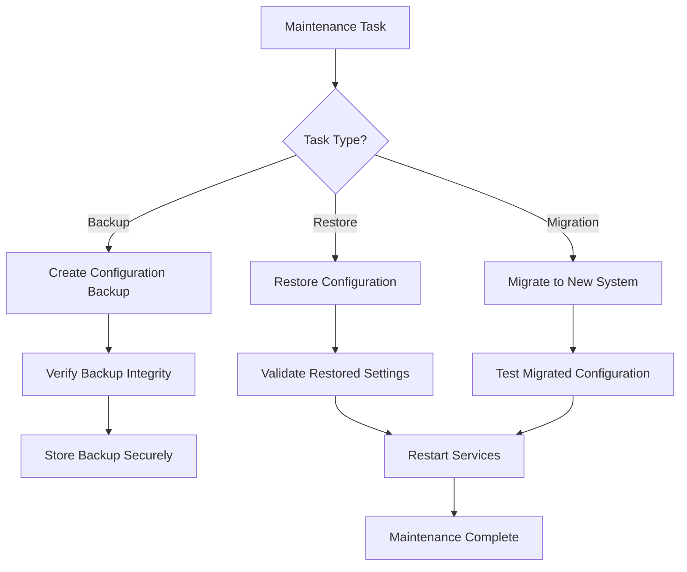
```mermaid
flowchart TD
    A[Maintenance Task] --> B{Task Type?}
    B -->|Backup| C[Create Configuration Backup]
    B -->|Restore| D[Restore Configuration]
    B -->|Migration| E[Migrate to New System]
    C --> F[Verify Backup Integrity]
    D --> G[Validate Restored Settings]
    E --> H[Test Migrated Configuration]
    F --> I[Store Backup Securely]
    G --> J[Restart Services]
    H --> J
    J --> K[Maintenance Complete]
```

**Backup Procedures:**

1. **Manual Configuration Backup**
   ```bash
   # Locate configuration directory
   # Windows: %APPDATA%\TalosDesk\
   # macOS: ~/Library/Application Support/TalosDesk/
   # Linux: ~/.config/talosdesk/
   
   # Create backup with timestamp
   CONFIG_DIR="[CONFIG_DIRECTORY]"
   BACKUP_NAME="talosdesk_backup_$(date +%Y%m%d_%H%M%S)"
   
   # Copy configuration files
   cp -r "$CONFIG_DIR" "$HOME/backups/$BACKUP_NAME"
   
   # Create archive
   tar -czf "$HOME/backups/$BACKUP_NAME.tar.gz" -C "$HOME/backups" "$BACKUP_NAME"
   ```

2. **Automated Backup Script**
   ```bash
   #!/bin/bash
   # talos-desk-backup.sh
   
   BACKUP_DIR="$HOME/backups/talosdesk"
   CONFIG_DIR="$HOME/.config/talosdesk"
   DATE=$(date +%Y%m%d_%H%M%S)
   
   mkdir -p "$BACKUP_DIR"
   
   # Create backup
   tar -czf "$BACKUP_DIR/config_$DATE.tar.gz" -C "$(dirname $CONFIG_DIR)" "$(basename $CONFIG_DIR)"
   
   # Keep only last 10 backups
   ls -t "$BACKUP_DIR"/config_*.tar.gz | tail -n +11 | xargs rm -f
   
   echo "Backup created: config_$DATE.tar.gz"
   ```

**Restore Procedures:**

1. **Configuration Restore**
   ```bash
   # Stop Talos Desk if running
   pkill talos-desk
   
   # Backup current configuration
   mv ~/.config/talosdesk ~/.config/talosdesk.backup
   
   # Extract backup
   tar -xzf config_backup.tar.gz -C ~/.config/
   
   # Restart application
   talos-desk &
   ```

2. **Selective Setting Restore**
   ```yaml
   Configuration Categories:
     Video Settings:
       - codec, bitrate, framerate
       - quality presets
       - hardware acceleration
     
     Network Settings:
       - RTSP port, authentication
       - firewall rules
       - access control
     
     Advanced Settings:
       - performance tuning
       - logging configuration
       - privacy settings
   ```

### 7.2 Software Updates Workflow

**Purpose:** Keep application current with latest features and security patches
**Time Estimate:** 10-15 minutes

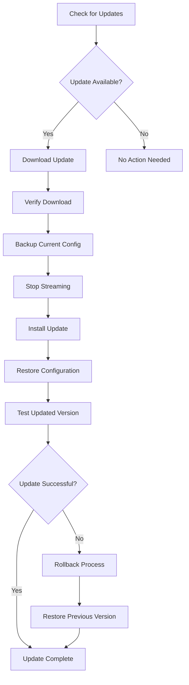
```mermaid
flowchart TD
    A[Check for Updates] --> B{Update Available?}
    B -->|Yes| C[Download Update]
    B -->|No| D[No Action Needed]
    C --> E[Verify Download]
    E --> F[Backup Current Config]
    F --> G[Stop Streaming]
    G --> H[Install Update]
    H --> I[Restore Configuration]
    I --> J[Test Updated Version]
    J --> K{Update Successful?}
    K -->|Yes| L[Update Complete]
    K -->|No| M[Rollback Process]
    M --> N[Restore Previous Version]
    N --> L
```

**Update Checking:**

1. **Automatic Update Check**
   ```yaml
   Update Configuration:
     Check Frequency: Weekly (configurable)
     Update Channel: Stable (default) | Beta | Development
     Auto-Download: Disabled (manual approval required)
     Notification: System tray notification
   
   Update Information Display:
     Current Version: 1.0.0
     Latest Version: 1.0.1
     Release Date: 2024-01-15
     Size: 18.5 MB
     Changes: Bug fixes, performance improvements
   ```

2. **Manual Update Check**
   ```bash
   # Command line update check
   talos-desk --check-updates
   
   # Display current version
   talos-desk --version
   
   # Download update manually
   talos-desk --download-update --version 1.0.1
   ```

**Update Installation:**

1. **Windows Update Process**
   ```batch
   # Automatic installer update
   TalosDesk-Update-1.0.1.exe /S /UPDATE
   
   # Manual MSI update
   msiexec /i TalosDesk-1.0.1.msi /quiet REINSTALL=ALL REINSTALLMODE=vomus
   ```

2. **macOS Update Process**
   ```bash
   # Application bundle replacement
   rm -rf "/Applications/Talos Desk.app"
   cp -R "Talos Desk.app" /Applications/
   
   # Preserve configuration
   # (automatic - stored in user directory)
   ```

3. **Linux Update Process**
   ```bash
   # Package manager update
   sudo apt update && sudo apt upgrade talos-desk
   
   # Manual package update
   sudo dpkg -i talos-desk_1.0.1_amd64.deb
   
   # AppImage update
   wget https://releases.talosdesk.com/v1.0.1/TalosDesk-1.0.1-x86_64.AppImage
   chmod +x TalosDesk-1.0.1-x86_64.AppImage
   ```

### 7.3 Performance Optimization Workflow

**Purpose:** Maintain optimal performance over time
**Time Estimate:** 20-30 minutes

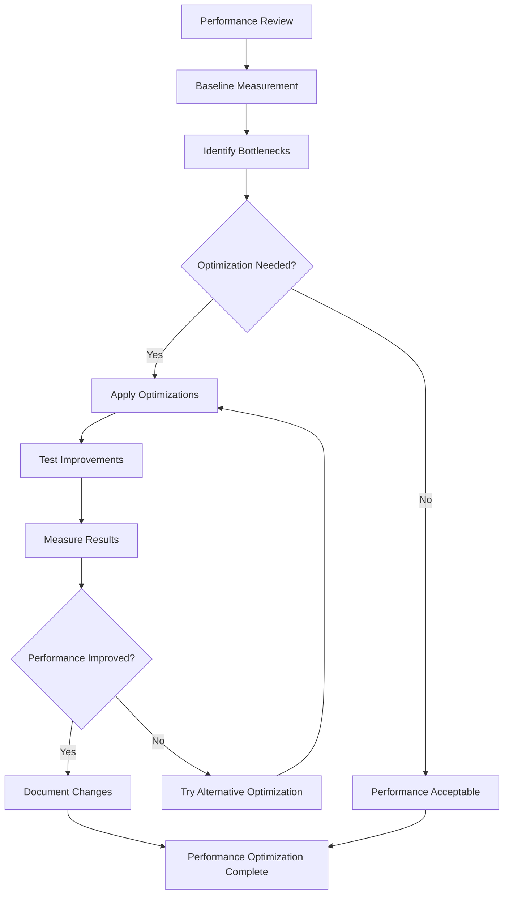
```mermaid
flowchart TD
    A[Performance Review] --> B[Baseline Measurement]
    B --> C[Identify Bottlenecks]
    C --> D{Optimization Needed?}
    D -->|Yes| E[Apply Optimizations]
    D -->|No| F[Performance Acceptable]
    E --> G[Test Improvements]
    G --> H[Measure Results]
    H --> I{Performance Improved?}
    I -->|Yes| J[Document Changes]
    I -->|No| K[Try Alternative Optimization]
    K --> E
    J --> L[Performance Optimization Complete]
    F --> L
```

**Performance Baseline:**
```yaml
Target Performance Metrics:
  CPU Usage: <15% (1080p30)
  Memory Usage: <200MB
  Frame Rate: 30.0 ± 0.1 fps
  Encoding Latency: <100ms
  Network Efficiency: >95%
  
Measurement Tools:
  Built-in: Real-time statistics in UI
  System: Task Manager, htop, Activity Monitor
  Network: iftop, netstat, Wireshark
  Profiling: Intel VTune, perf, Instruments
```

**Optimization Strategies:**

1. **Hardware Acceleration**
   ```yaml
   GPU Optimization:
     - Enable hardware encoding (NVENC/QuickSync/VCE)
     - Update graphics drivers
     - Optimize GPU memory allocation
     - Balance CPU/GPU workload
   
   CPU Optimization:
     - Use optimal thread count
     - Enable CPU-specific optimizations (AVX2, SSE4)
     - Adjust process priority
     - Optimize memory allocation
   ```

2. **Encoding Optimization**
   ```yaml
   Quality vs Performance:
     Fast Preset: ultrafast, superfast, veryfast
     Balanced Preset: fast, medium
     Quality Preset: slow, slower, veryslow
   
   Advanced Settings:
     - B-frame optimization
     - Motion estimation settings
     - Rate control algorithm
     - Keyframe interval tuning
   ```

3. **System Optimization**
   ```yaml
   Operating System:
     - Disable unnecessary services
     - Optimize power management
     - Configure network stack
     - Adjust virtual memory settings
   
   Application Settings:
     - Thread pool optimization
     - Memory pool configuration
     - I/O optimization
     - Cache management
   ```

---

## Security Workflows

### 8.1 User Management Workflow

**Purpose:** Configure secure access to Talos Desk streaming
**Time Estimate:** 10-15 minutes

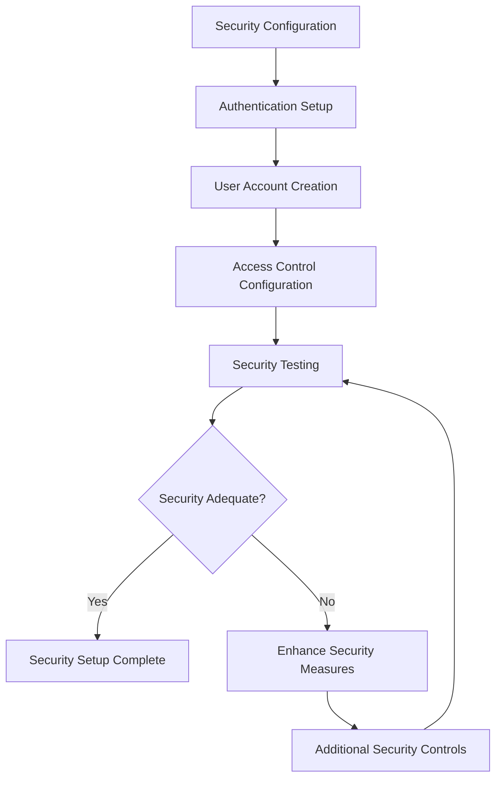
```mermaid
flowchart TD
    A[Security Configuration] --> B[Authentication Setup]
    B --> C[User Account Creation]
    C --> D[Access Control Configuration]
    D --> E[Security Testing]
    E --> F{Security Adequate?}
    F -->|Yes| G[Security Setup Complete]
    F -->|No| H[Enhance Security Measures]
    H --> I[Additional Security Controls]
    I --> E
```

**Authentication Configuration:**

1. **Basic Authentication Setup**
   ```yaml
   Security Level: Basic
   Configuration:
     Username: admin
     Password: [12+ character strong password]
     Authentication Type: Digest (recommended)
     
   Password Requirements:
     - Minimum 12 characters
     - Include uppercase, lowercase, numbers, symbols
     - No dictionary words
     - Regular rotation (90 days recommended)
   ```

2. **Advanced Authentication**
   ```yaml
   Enhanced Security:
     Two-Factor Authentication: Future feature
     Certificate-Based Auth: Future feature
     LDAP Integration: Future feature
     
   Current Security Features:
     - Digest authentication (RFC 2617)
     - Secure password hashing
     - Session timeout configuration
     - Failed login rate limiting
   ```

**User Account Management:**
```yaml
Account Configuration:
  Primary Admin:
    Username: admin
    Role: Full access
    Permissions: All operations
    
  Viewer Account:
    Username: viewer
    Role: Read-only
    Permissions: Stream viewing only
    
  VMS Account:
    Username: vms_system
    Role: Service account
    Permissions: Stream access, device info
```

### 8.2 Access Control Setup Workflow

**Purpose:** Implement network-based access restrictions
**Time Estimate:** 15-20 minutes

```mermaid
flowchart TD
    A[Access Control Planning] --> B[Network Assessment]
    B --> C[IP Whitelist Configuration]
    C --> D[Firewall Rules Setup]
    D --> E[Rate Limiting Configuration]
    E --> F[Security Testing]
    F --> G{Access Control Working?}
    G -->|Yes| H[Document Security Policy]
    G -->|No| I[Troubleshoot Access Issues]
    I --> F
    H --> J[Access Control Complete]
```

**Network Access Control:**

1. **IP Whitelist Configuration**
   ```yaml
   Whitelist Configuration:
     Allowed Networks:
       - 192.168.1.0/24 (Local LAN)
       - 10.0.100.0/24 (VMS Network)
       - 172.16.50.10/32 (Specific VMS Server)
     
     Blocked by Default: All other IPs
     
   Configuration Example:
     {
       "access_control": {
         "enabled": true,
         "default_policy": "deny",
         "whitelist": [
           "192.168.1.0/24",
           "10.0.100.0/24",
           "172.16.50.10/32"
         ]
       }
     }
   ```

2. **Firewall Integration**
   ```bash
   # Windows Firewall rules
   netsh advfirewall firewall add rule name="Talos Desk RTSP" dir=in action=allow protocol=TCP localport=554 remoteip=192.168.1.0/24
   
   # Linux iptables rules
   sudo iptables -A INPUT -p tcp --dport 554 -s 192.168.1.0/24 -j ACCEPT
   sudo iptables -A INPUT -p tcp --dport 554 -j DROP
   
   # Save rules
   sudo iptables-save > /etc/iptables/rules.v4
   ```

**Rate Limiting Configuration:**
```yaml
Rate Limiting Settings:
  Connection Limits:
    Max Connections per IP: 3
    Max Total Connections: 10
    Connection Timeout: 300 seconds
    
  Request Limits:
    RTSP Requests per minute: 100
    Authentication attempts per minute: 5
    Failed login lockout: 15 minutes
    
  Bandwidth Limits:
    Per-client bandwidth limit: 15 Mbps
    Total bandwidth limit: 100 Mbps
    Burst allowance: 20 Mbps for 30 seconds
```

### 8.3 Privacy Mask Configuration Workflow

**Purpose:** Protect sensitive information in screen capture
**Time Estimate:** 10-15 minutes

```mermaid
flowchart TD
    A[Privacy Assessment] --> B[Identify Sensitive Areas]
    B --> C[Configure Privacy Masks]
    C --> D[Test Mask Effectiveness]
    D --> E{Privacy Adequate?}
    E -->|Yes| F[Save Privacy Configuration]
    E -->|No| G[Adjust Mask Settings]
    G --> C
    F --> H[Privacy Setup Complete]
```

**Privacy Mask Setup:**

1. **Sensitive Area Identification**
   ```yaml
   Common Sensitive Areas:
     - Password fields and login forms
     - Personal information displays
     - Financial data and account numbers
     - Confidential documents
     - Chat/messaging applications
     - Email content
     - Browser address bars
   ```

2. **Mask Configuration**
   ```yaml
   Privacy Mask Options:
     Types:
       - Black box (complete obscuring)
       - Blur effect (content recognition prevention)
       - Pixelate (digital noise)
       - Custom color overlay
     
     Configuration:
       - Rectangular regions
       - Dynamic window following
       - Application-specific masks
       - Temporary mask toggle
   ```

3. **Privacy Mask Interface**
   ```yaml
   Configuration UI:
     Mask Editor:
       - Click and drag to create mask regions
       - Resize handles for adjustment
       - Preview mode for testing
       - Mask type selection per region
     
     Dynamic Masks:
       - Application window following
       - Text field detection
       - URL bar masking
       - Notification area protection
   ```

**Privacy Configuration Example:**
```json
{
  "privacy_masks": [
    {
      "name": "Login Form Protection",
      "type": "black_box",
      "region": {
        "x": 100,
        "y": 200,
        "width": 300,
        "height": 150
      },
      "enabled": true,
      "dynamic": false
    },
    {
      "name": "Browser Address Bar",
      "type": "blur",
      "application": "chrome.exe",
      "region": {
        "x": 50,
        "y": 50,
        "width": 800,
        "height": 40
      },
      "enabled": true,
      "dynamic": true
    }
  ]
}
```

### 8.4 Security Hardening Workflow

**Purpose:** Implement comprehensive security measures
**Time Estimate:** 30-45 minutes

```mermaid
flowchart TD
    A[Security Assessment] --> B[Network Security]
    B --> C[Application Security]
    C --> D[System Security]
    D --> E[Monitoring Setup]
    E --> F[Security Testing]
    F --> G{Security Adequate?}
    G -->|Yes| H[Document Security Policy]
    G -->|No| I[Additional Hardening]
    I --> F
    H --> J[Security Hardening Complete]
```

**Security Hardening Checklist:**

1. **Network Security**
   ```yaml
   Required Measures:
     ✓ Enable authentication (Digest recommended)
     ✓ Configure IP whitelist
     ✓ Use non-default RTSP port if possible
     ✓ Enable rate limiting
     ✓ Configure firewall rules
     ✓ Disable unnecessary network services
   
   Advanced Measures:
     ○ TLS encryption (future feature)
     ○ VPN-only access
     ○ Network segmentation
     ○ Intrusion detection system
   ```

2. **Application Security**
   ```yaml
   Configuration Security:
     ✓ Secure configuration file permissions
     ✓ Encrypted credential storage
     ✓ Regular security updates
     ✓ Minimal privilege execution
     
   Runtime Security:
     ✓ Input validation
     ✓ Buffer overflow protection
     ✓ Memory protection
     ✓ Process isolation
   ```

3. **System Security**
   ```yaml
   Operating System:
     ✓ Keep OS updated
     ✓ Disable unnecessary services
     ✓ Configure secure user accounts
     ✓ Enable system logging
     
   Hardware Security:
     ✓ Physical access protection
     ✓ Secure boot (if available)
     ✓ TPM utilization (future)
     ✓ Hardware security modules (enterprise)
   ```

**Security Monitoring:**
```yaml
Security Event Logging:
  Authentication Events:
    - Successful logins
    - Failed login attempts
    - Account lockouts
    - Password changes
  
  Network Events:
    - Connection attempts
    - Denied connections
    - Rate limit violations
    - Unusual traffic patterns
  
  System Events:
    - Configuration changes
    - Application starts/stops
    - Error conditions
    - Performance anomalies

Log Analysis:
  Real-time Monitoring:
    - Failed authentication alerts
    - Unusual connection patterns
    - Performance degradation
    - Error rate increases
  
  Periodic Review:
    - Access pattern analysis
    - Security incident investigation
    - Performance trend analysis
    - Compliance reporting
```

**Security Compliance:**
```yaml
Compliance Frameworks:
  General Security:
    - Regular security assessments
    - Vulnerability management
    - Incident response procedures
    - Security training and awareness
  
  Industry Specific:
    - GDPR compliance (if applicable)
    - HIPAA compliance (healthcare)
    - SOX compliance (financial)
    - ISO 27001 alignment
```

---

## Workflow Summary

This comprehensive workflow documentation provides detailed procedures for:

- **Installation**: Platform-specific installation procedures with validation steps
- **Configuration**: Complete setup workflows for video, network, and advanced settings
- **Operations**: Day-to-day streaming management and system tray operations
- **Integration**: VMS-specific integration procedures with troubleshooting
- **Monitoring**: Performance tracking and client connection management
- **Troubleshooting**: Systematic problem resolution with common solutions
- **Maintenance**: Backup, updates, and performance optimization procedures
- **Security**: Authentication, access control, and privacy protection workflows

Each workflow includes:
- Clear step-by-step procedures
- Time estimates for planning
- Decision trees for complex scenarios
- Validation steps and expected outcomes
- Troubleshooting guidance
- Best practices and recommendations

The documentation supports both technical and non-technical users with appropriate detail levels and clear visual flow diagrams using Mermaid syntax for complex decision processes.